# Module 1: Introduction to Self-Service BI Solutions

- [Module 1: Introduction to Self-Service BI Solutions](#module-1-introduction-to-self-service-bi-solutions)
  - [Lab: Exploring an Enterprise BI Solution](#lab-exploring-an-enterprise-bi-solution)
    - [Exercise 1: Lab Environment Setup](#exercise-1-viewing-reports)
      - [Task 1: Prepare the Lab Environment](#task-1-prepare-the-lab-environment)
    - [Exercise 2: Creating a Power BI Report](#exercise-2-creating-a-power-bi-report)
      - [Task 1: Import Data into Power BI Desktop](#task-1-import-data-into-power-bi-desktop)
      - [Task 2: Add Visualizations to the Report](#task-2-add-visualizations-to-the-report)

**Note:** Lab Solution is present in `Desktop\power-bi-quickstart\Labfiles\Lab01\Solution` folder:

## Lab: Exploring an Enterprise BI Solution

### Exercise 1: Lab Environment Setup

Lab environment is already setup.

### Exercise 2: Creating a Power BI Report

#### Task 1: Import Data into Power BI Desktop

1. Make sure previous task was completed.

2. On the Taskbar, click **Power BI Desktop**.

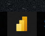

3. Click **New** > **Report**:

4. On the **Power BI Desktop** screen appears, click **Get data**.

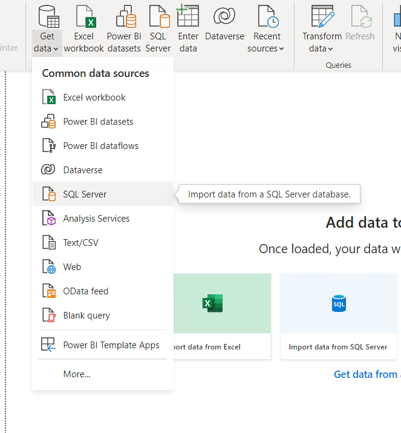

5. In the **Get Data** dialog box, click **SQL Server**, and then click **Connect**.

6. In the **SQL Server database** dialog box, in the **Server** box, type **localhost**.

7. In the **Database (optional)** box, type **AdventureWorksDW**, and then click **OK**.

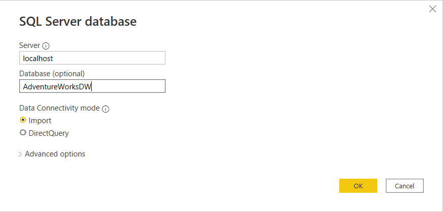

8. If the **SQL Server database** dialog box appears, leave the default settings unchanged, and then click **Connect**.

9. If the **Encryption Support** dialog box appears, click **OK**.

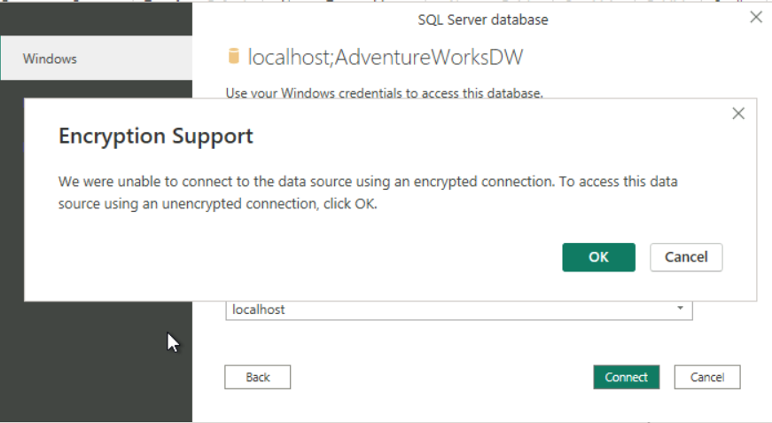

10. In the **Navigator** dialog box, select the **FactInternetSales** check box.

11. Click **Select Related Tables**, and then click **Load**.

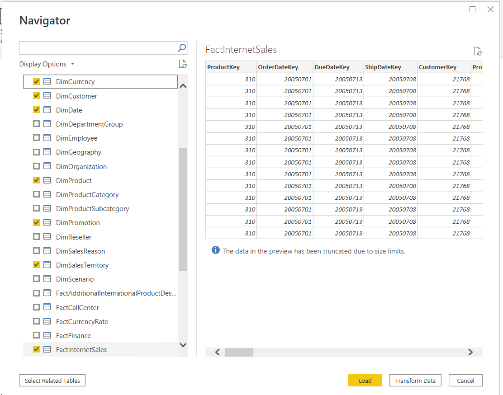

**Note:** Wait for some time while tables are loaded.

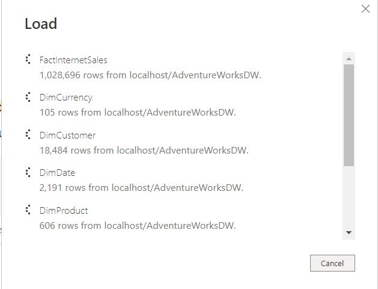

12. On the **File** menu, click **Save**.

13. In the **Save As** dialog box, browse to the **Desktop\\power-bi-quickstart\\Labfiles\\Lab01\\Starter\\Project** folder, and in the **File name** box, type **Adventure Works Sales 1**, and then click **Save**.

#### Task 2: Add Visualizations to the Report

1. In the **Data** pane, expand **FactInternetSales**, and drag the **SalesAmount** field onto the report canvas to create a column chart.

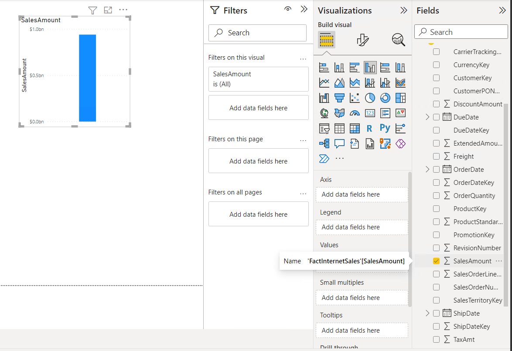

2. Expand **DimDate**, and drag the **EnglishDayNameOfWeek** field to the **X-axis** property.

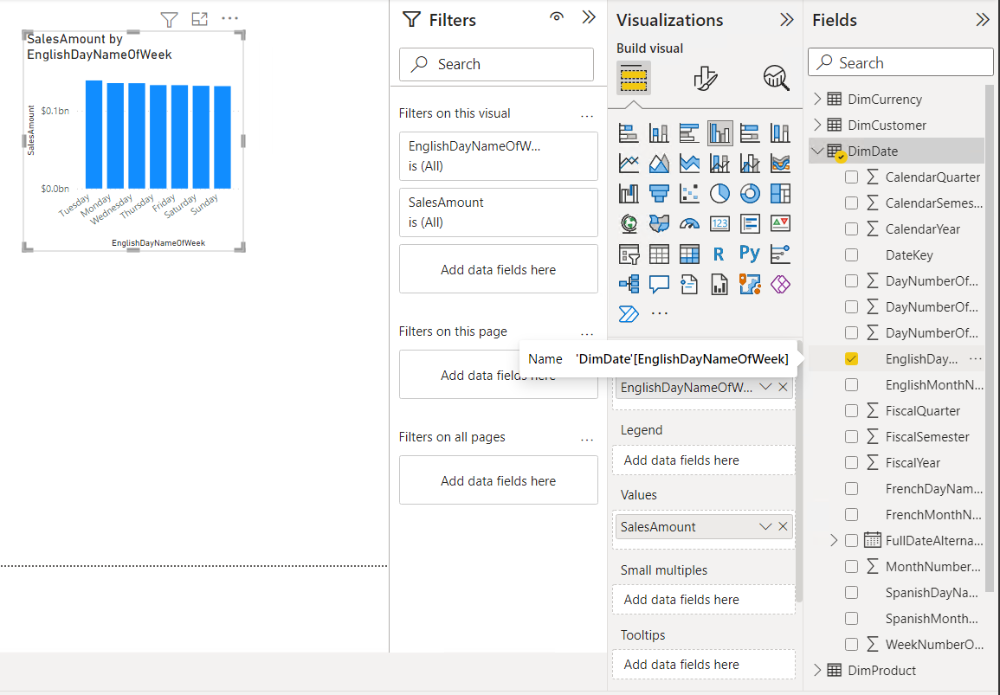

3. Move the chart to the top left-hand corner of the canvas, and expand the chart width so the days of the week display in full.

4. In the **VISUALIZATIONS** pane, click **Format**, and expand **Title**.

5. In the **Title text** box, type **Sales by Day of Week**.

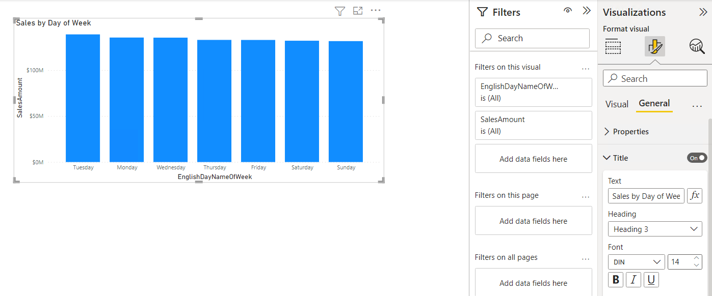

6. Next to **Alignment**, click the **Center** icon.

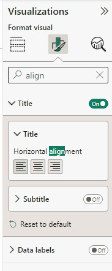

7. In the **Data** pane, under **FactInternetSales**, drag the **SalesAmount** field onto the report canvas to create a column chart.

8. Under **DimDate**, drag the **CalendarQuarter** field onto the chart. Notice that there is only one column.

9. In the **VISUALIZATIONS** pane, click **Data**. Drag the **CalendarQuarter** field from **Y-axis** to **X-axis**.

10. Click **Format**, and expand **Title**.

11. In the **Title text** box, type **Sales by Calendar Quarter**.

12. Next to **Alignment**, click the **Center** icon.

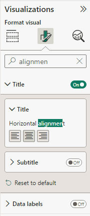

13. Go to **Columns** > **Color** in the `Format` tab and apply conditional formatting by changing default color for lowest value and click `OK`:

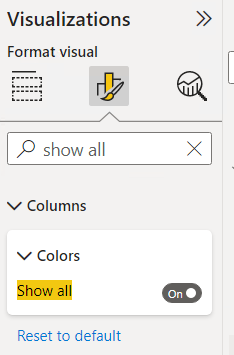

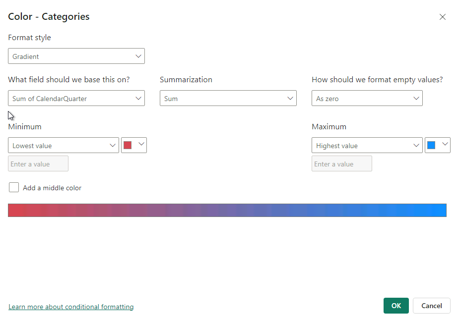

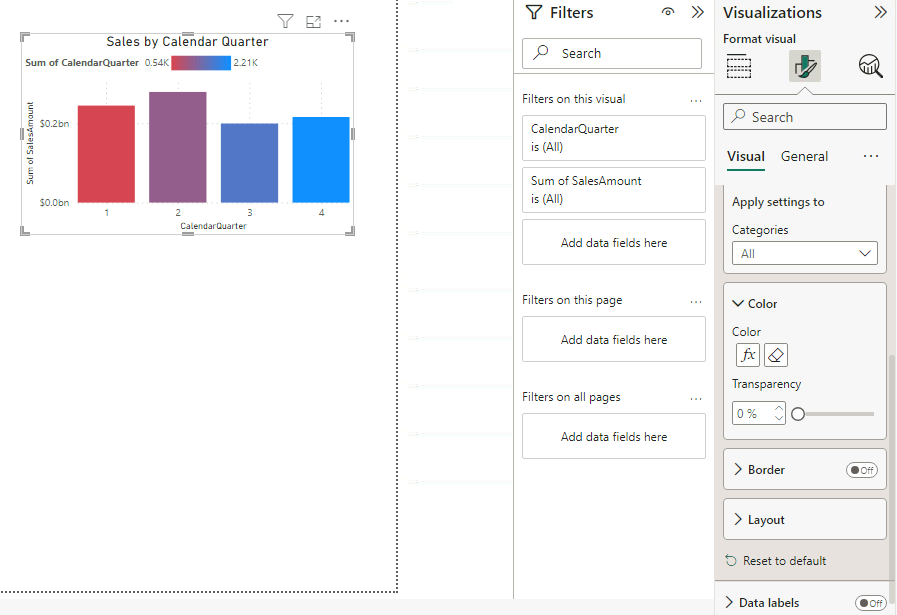

14. Move the chart to the right of the **Sales by Day of Week** chart, and expand the chart as well so both charts are the same height.

15. In the **Data** pane, expand **DimSalesTerritory**, and drag the **SalesTerritoryCountry** column onto the report canvas under the **Sales by Day of Week** chart.

**Note:** Map and filled map visuals option are disabled by default. You will need to enabled it first.

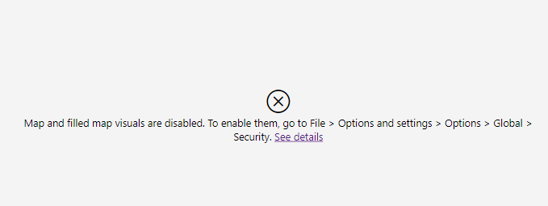

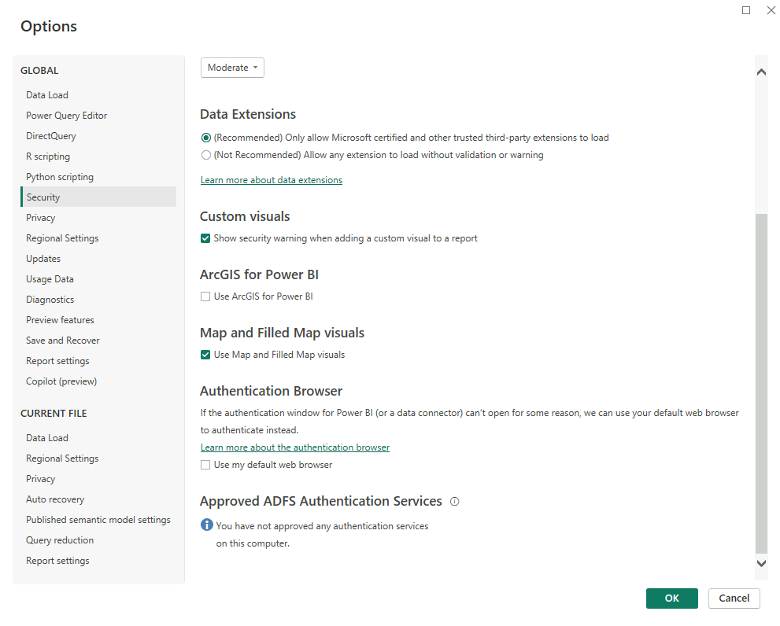

16. Under **FactInternetSales**, drag the **SalesAmount** field onto the map.

17. Expand the map to show all the values.

18. In the **Title text** box, type **Sales by Country**.

19. Next to **Alignment**, click the **Center** icon.

20. In the **Data** pane, expand **DimCustomer**, and drag the **CommuteDistance** field onto the report canvas under the **Sales by Calendar Quarter** chart.

21. Under **FactInternetSales**, drag the **SalesAmount** field onto the chart.

22. In the **VISUALIZATIONS** pane, click **Donut chart**.

23. In the **Title text** box, type **Sales by Commute Distance**.

24. Next to **Alignment**, click the **Center** icon.

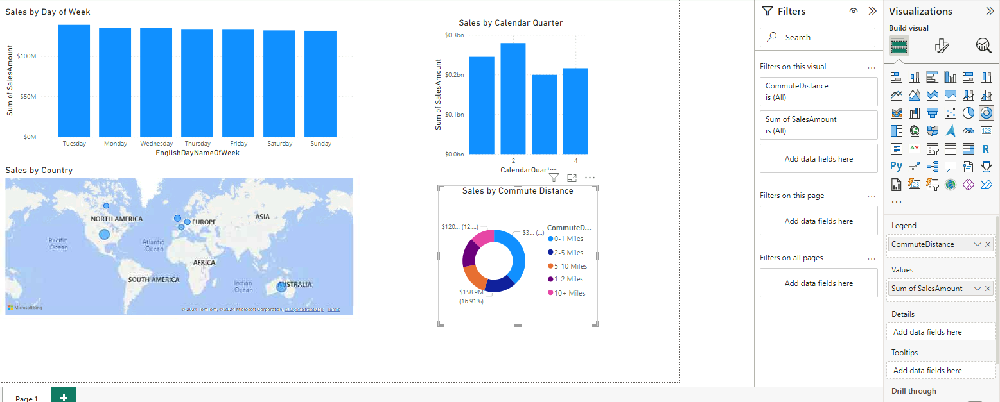

25. On the **File** menu, click **Save**.
