# Module 4: Shaping and Combining Data

- [Module 4: Shaping and Combining Data](#module-4-shaping-and-combining-data)
  - [Lab: Shaping and Combining Data](#lab-shaping-and-combining-data)
    - [Exercise 1: Shape Power BI Data](#exercise-1-shape-power-bi-data)
      - [Task 1: Preparing the Environment](#task-1-preparing-the-environment)
      - [Task 2: Import Data from Excel](#task-2-import-data-from-excel)
      - [Task 3: Apply Formatting to the Existing Data](#task-3-apply-formatting-to-the-existing-data)
    - [Exercise 2: Combine Power BI Data](#exercise-2-combine-power-bi-data)
      - [Task 1: Add Related Data to the Shaped Data](#task-1-add-related-data-to-the-shaped-data)

**Note:** Lab Solution is present in `Desktop\power-bi-quickstart\Labfiles\Lab04\Solution` folder:

## Lab: Shaping and Combining Data

### Exercise 1: Shape Power BI Data

#### Task 1: Preparing the Environment

Lab environment is already setup.

#### Task 2: Import Data from Excel

1. Make sure previous task was completed.

2. On the Taskbar, click **Power BI Desktop**.

3. Click **New** > **Report**:

5. In the **Power BI Desktop** window, click **Get data**.

6. In the **Get Data** window, click **Excel Workbook**:

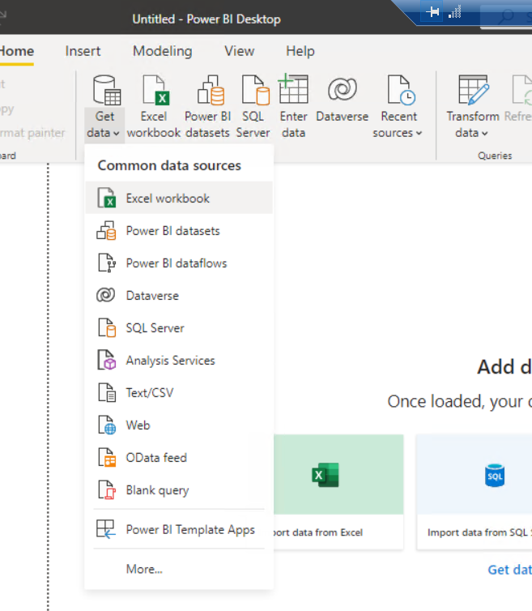

7. In the **Open** dialog box, browse to the **Desktop\\power-bi-quickstart\\Labfiles\\Lab04\\Starter\\Project** folder, click **Sales - Europe.xlsx**, and then click **Open**.

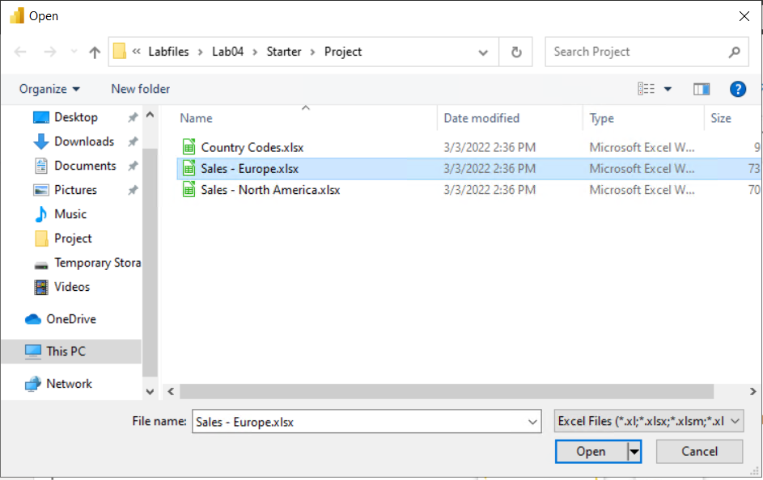

8. In the **Navigator** window, select the **Europe** check box, and then click **Load**.

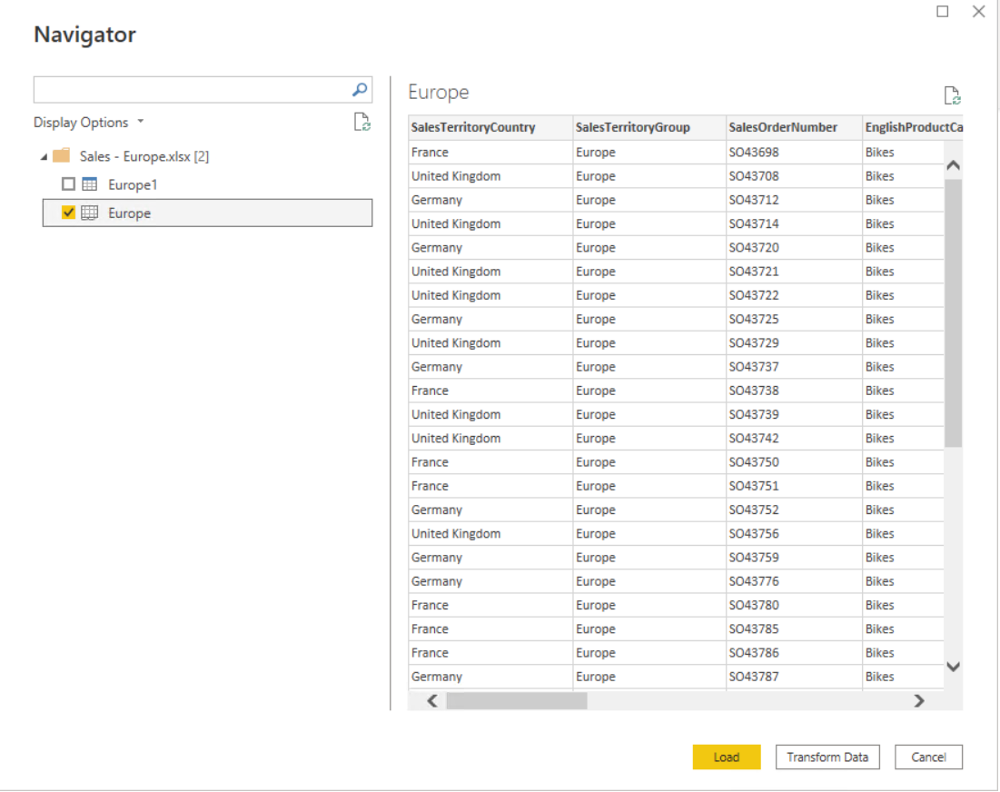

9. On the **Home** tab, click the **Get Data** arrow, and then click **Excel Workbook**.

10. In the **Open** dialog box, browse to the **Desktop\\power-bi-quickstart\\Labfiles\\Lab04\\Starter\\Project** folder, click **Sales - North America.xlsx**, and then click **Open**.

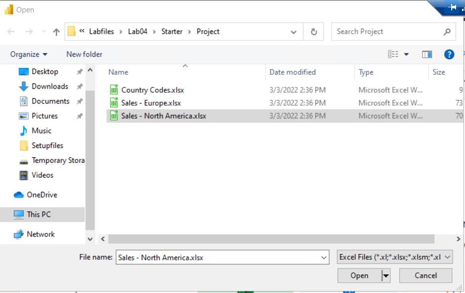

11. In the **Navigator** window, select the **North America** check box, and then click **Transform Data**. This opens the Power Query Editor window.

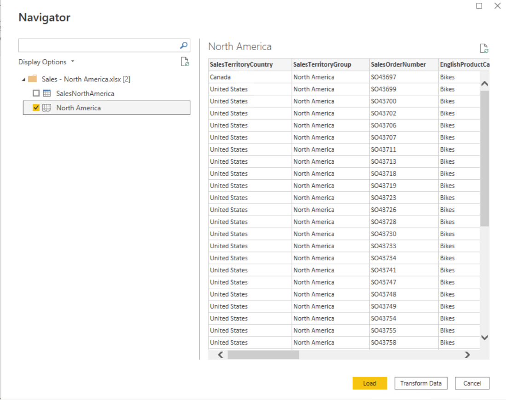

#### Task 3: Apply Formatting to the Existing Data

1. In the **Queries \[2\]** pane, click **Europe** to show the data preview if this is not already displayed.

2. Right-click the **ProductKey** column, and click **Remove**.

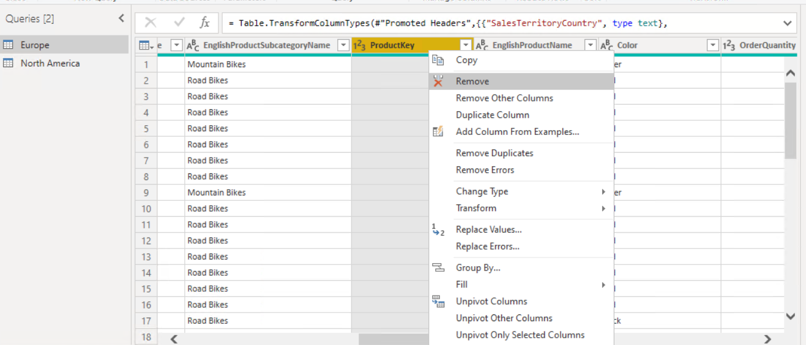

3. Right-click the **SalesOrderNumber** column, and click **Remove**.

4. Right-click the **SalesTerritoryCountry** column, click **Rename**, type **Country**, and then press Enter.

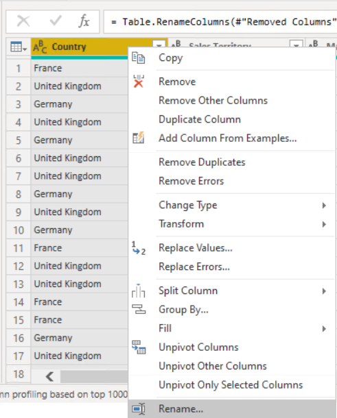

5. Right-click the **SalesTerritoryGroup** column, click **Rename**, type **Sales Territory**, and then press Enter.

6. Right-click the **EnglishProductCategoryName** column, click **Rename**, type **Main Category**, and then press Enter.

7. Right-click the **EnglishProductSubcategoryName** column, click **Rename**, type **Sub Category**, and then press Enter.

8. Right-click the **EnglishProductName** column, click **Rename**, type **Product**, and then press Enter.

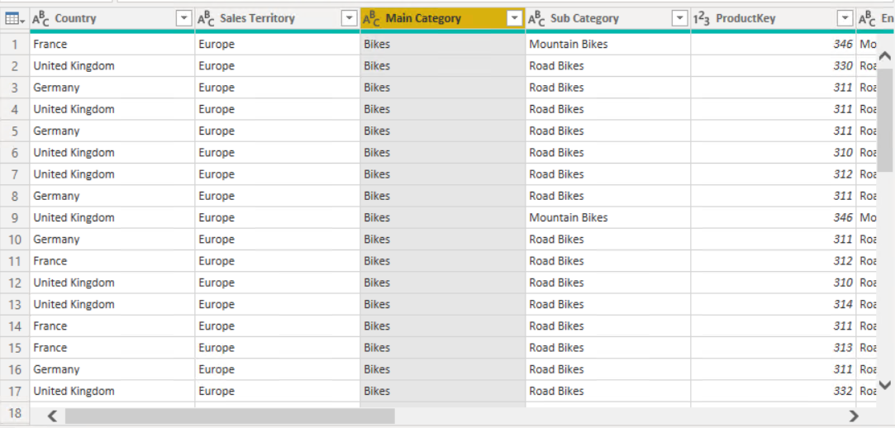

9. Right-click the **Color** column, point to **Move**, and then click **Left**.

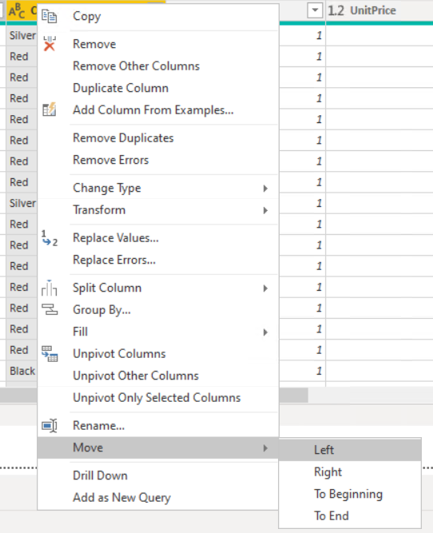

10. In the **Queries \[2\]** pane, click **North America**.

11. Right-click the **ProductKey** column, and click **Remove**.

12. Right-click the **SalesOrderNumber** and click **Remove**.

13. Right-click the **SalesTerritoryCountry** column, click **Rename**, type **Country**, and then press Enter.

14. Right-click the **SalesTerritoryGroup** column, click **Rename**, type **Sales Territory**, and then press Enter.

15. Right-click the **EnglishProductCategoryName** column, click **Rename**, type **Main Category**, and then press Enter.

16. Right-click the **EnglishProductSubcategoryName** column, click **Rename**, type **Sub Category**, and then press Enter.

17. Right-click the **EnglishProductName** column, click **Rename**, type **Product**, and then press Enter.

18. Right-click the **Color** column, point to **Move**, and then click **Left**.

19. On the **Home** tab, in the **Query** group, click **Advanced Editor**. Notice that the query includes the changes you have made, and then click **Cancel**.

20. Leave the Power Query Editor window open for the next exercise.

---

### Exercise 2: Combine Power BI Data

#### Task 1: Add Related Data to the Shaped Data

1. In the **Queries \[2\]** pane, click **Europe**.

2. On the **Home** tab, in the **Combine** group, click **Append Queries**.

3. In the **Append** dialog box, in the **Table to append** list, click **North America**, and then click **OK**. The rows are combined.

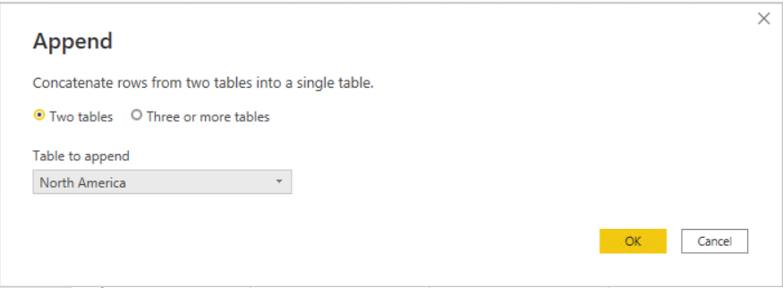

4. On the **Country** column header, click the **Arrow**, and then click **Load** **more**. You should now see that **United States** and **Canada** are included, and then click **Cancel**.

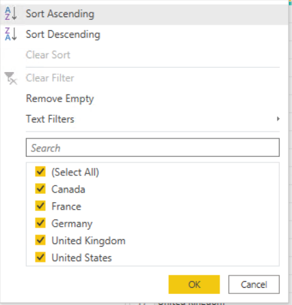

5. On the **Home** tab, click the **New Source** arrow, and then click **Excel WorkBook**.

6. In the **Open** dialog box, browse to the **Desktop\\power-bi-quickstart\\Labfiles\\Lab04\\Starter\\Project** folder, click **Country Codes.xlsx**, and then click **Open**.

7. In the **Navigator** dialog box, select the **Country Codes** check box, and then click **OK**.

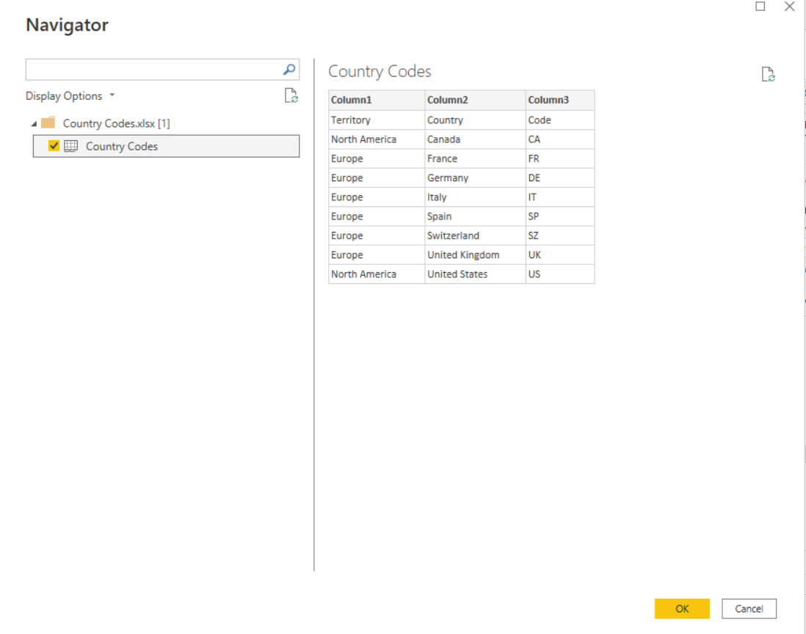

8. Click **Use First Row as Headers** as shown below:

9. In Power Query Editor, in the **Queries \[3\]** pane, click **Europe**.

10. On the **Home** tab, in the **Combine** group, click **Merge Queries**.

11. In the **Merge** dialog box, click the **Country** column to select it.

12. In the list below the table, click **Country Codes**, click the **Country** column, and then click **OK**.

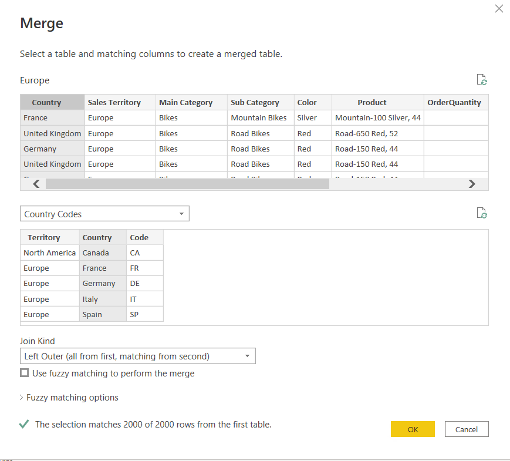

13. The **Country Codes** is added to the **Europe** query.

14. In the **Country Codes** header, click the **double-arrow** icon, clear the **Territory**, **Country**, and **Use original column name as prefix** check boxes, and then click **OK**.

15. Right-click the **Code** column, point to **Move**, and click **To Beginning**.

16. Right-click the **Code** column, click **Rename**, type **Country Code**, and then press Enter.

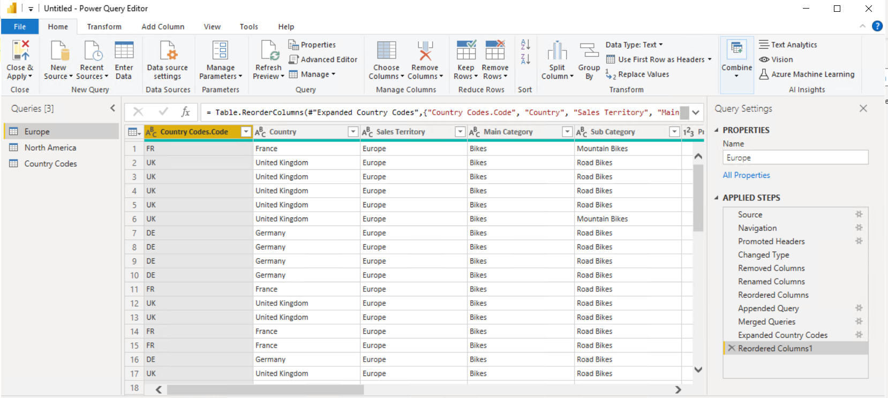

17. On the **Home** tab, click the **Close & Apply** arrow, and then click **Apply**.

18. Close Power Query Editor, and then close Power BI Desktop without saving any changes.
