# Module 5: Modeling Data

- [Module 5: Modeling Data](#module-5-modeling-data)
  - [Lab: Modeling Data](#lab-modeling-data)
    - [Exercise 1: Create Relationships](#exercise-1-create-relationships)
      - [Task 1: Preparing the Environment](#task-1-preparing-the-environment)
      - [Task 2: Automatic Relationships](#task-2-automatic-relationships)
      - [Task 3: Manual Relationships](#task-3-manual-relationships)
    - [Exercise 2: Calculations](#exercise-2-calculations)
      - [Task 1: Adding Calculated Columns](#task-1-adding-calculated-columns)

**Note:** Lab Solution is present in `Desktop\power-bi-quickstart\Labfiles\Lab05\Solution` folder:

## Lab: Modeling Data

### Exercise 1: Create Relationships

#### Task 1: Preparing the Environment

Lab environment is already setup.

#### Task 2: Automatic Relationships

1. Make sure previous tasks was completed.

2. On the Taskbar, click **Power BI Desktop**.

3. Click **New** > **Report**:


5. In the **Power BI Desktop** window, click **Get data**.

6. In the **Get Data** dialog box, ensure **Excel WorkBook** is selected.


7. In the **Open** dialog box, navigate to **Desktop\\power-bi-quickstart\\Labfiles\\Lab05\\Starter\\Project**, click **Adventure Works Sales Data.xlsx**, and then click **Open**.

13. In the **Navigator** dialog box, select the **DimCurrency**, **DimCustomer**, **DimDate**, **DimProduct**, **DimPromotion**, **DimSalesTerritory**, and **FactInternetSales** check boxes, and then click **Load**.

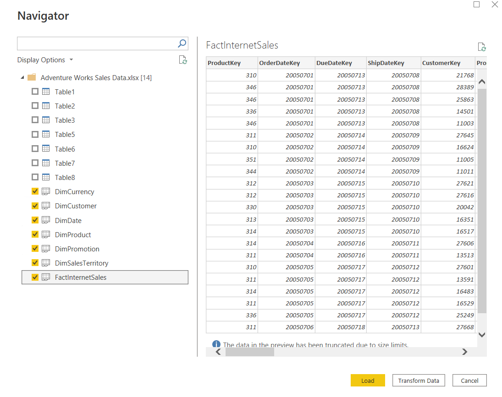

14. In the views pane on the left-hand side, click **Model**.

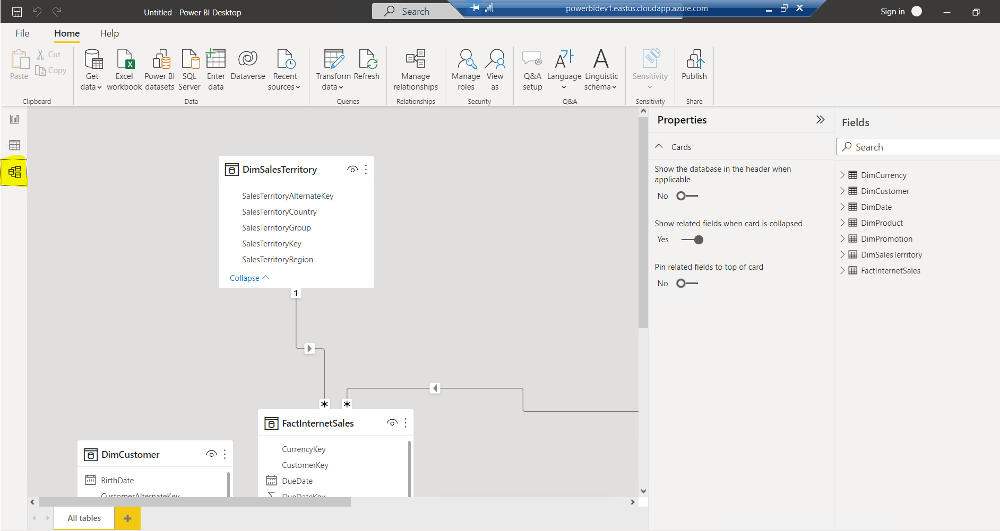

15. On the **Home** tab, click **Manage Relationships**.

16. In the **Manage relationships** dialog box, click **New**.

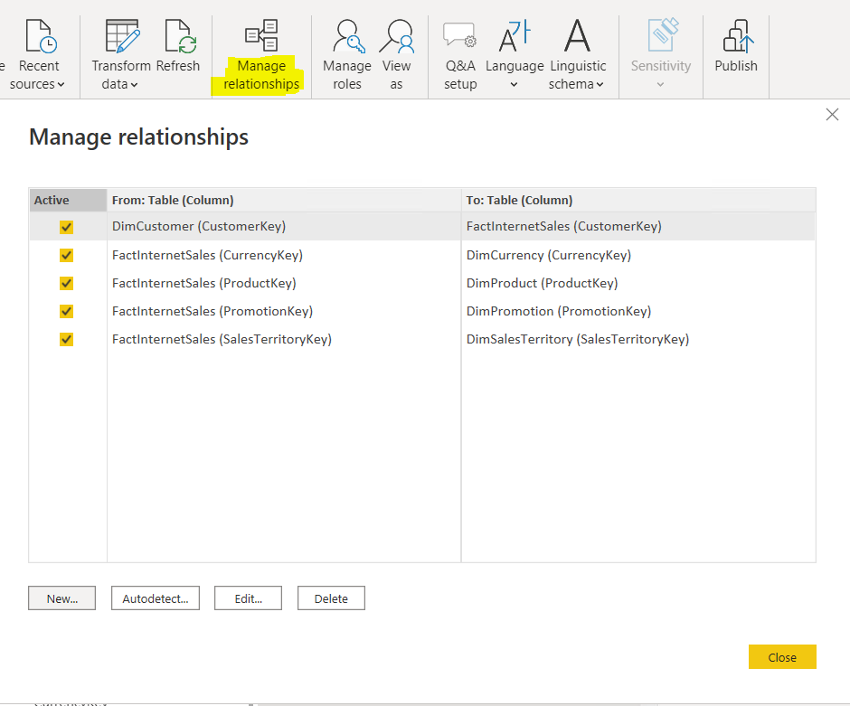

17. In the **New relationship** dialog box, in the top table list, click **FactInternetSales**. When the table preview appears below, click the **OrderDateKey** column.

18. In the bottom table list, click **DimDate**. When the table preview appears below, click the **DateKey** column.

19. Check that the **Cardinality** is selected to **Many to one (*:1)**, the **Cross filter direction** is **Single**, and **Make this relationship active** is selected, and then click **OK**.

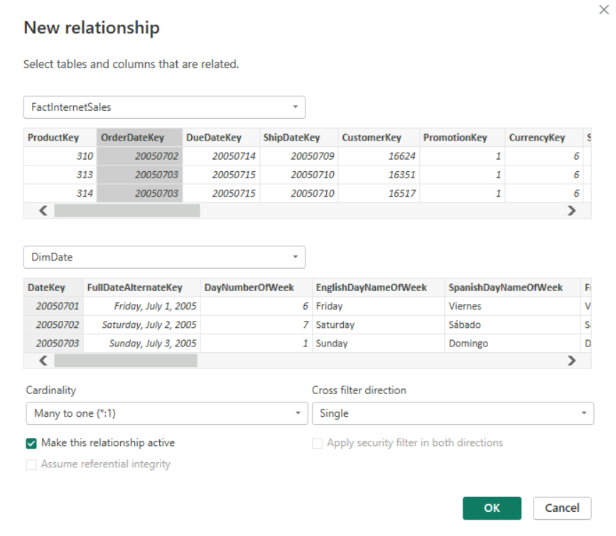

20. In the **Manage relationships** dialog box, click **Close**.

21. In the diagram, in the **FactInternetSales** table, click the **DueDateKey** column. Drag the **DueDateKey** column to the **DateKey** column of the **DimDate** table.

22. In the diagram, in the **FactInternetSales** table, click the **ShipDateKey** column. Drag the **ShipDateKey** column to the **DateKey** column of the **DimDate** table.

23. On the **Home** tab, click **Manage Relationships**.

24. In the **Manage relationships** dialog box, double-click the **FactInternetSales** **(CurrencyKey)** relationship.

25. In the **Edit relationships** dialog box, in the **Cross filter direction** list, ensure **Single** is selected, and then click **OK**.

26. In the **Manage relationships** dialog box, double-click the **FactInternetSales** **(ProductKey)** relationship.

27. In the **Edit relationships** dialog box, in the **Cross filter direction** list, ensure **Single** is selected, and then click **OK**.

28. In the **Manage relationships** dialog box, double-click the **FactInternetSales** **(PromotionKey)** relationship.

29. In the **Edit relationships** dialog box, in the **Cross filter direction** list, ensure **Single** is selected, and then click **OK**.

30. In the **Manage relationships** dialog box, double-click the **FactInternetSales** **(SalesTerritoryKey)** relationship.

31. In the **Edit relationships** dialog box, in the **Cross filter direction** list, ensure **Single** is selected, and then click **OK**.

32. In the **Manage relationships** dialog box, click **Close**.

33. Right-click the relationship line between **FactInternetSales** and **DimCustomer**, and then click **Delete**.

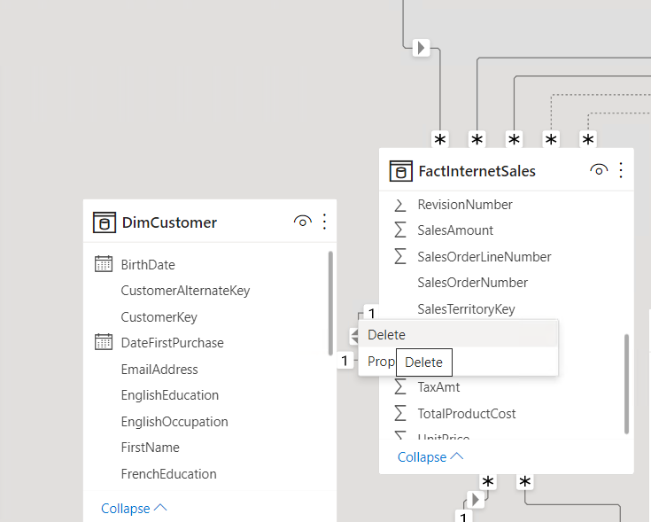

34. In the **Delete Relationship** dialog box, click **Yes**.


35. On the **Home** tab, click **Manage Relationships**.

36. In the **Manage relationships** dialog box, click **New**.

37. In the **New relationship** dialog box, in the top table list, click **FactInternetSales**, and in the data preview, click **CustomerKey**.

38. In the bottom table list, click **DimCustomer**, and in the data preview, click **CustomerKey**.

39. In the **Cardinality** list, click **Many to one (*:1)**, and then click **OK**.

40. In the **Manage relationships** dialog box, click **Close**.

41. On the **File** menu, click **Save**.

42. In the **Save As** dialog box, navigate to the **Desktop\\power-bi-quickstart\\Labfiles\\Lab05\\Starter** folder, and in the **File name** box, type **Adventure Works Sales 5.pbix**, and then click **Save**.

#### Task 3: Manual Relationships

1. In Power BI Desktop, on the **Home** tab, click the **Get Data** arrow, and then click **Excel**.

2. In the **Open** dialog box, navigate to **Desktop\\power-bi-quickstart\\Labfiles\\Lab05\\Starter\\Project**, click **Adventure Works Product Categories.xlsx**, and then click **Open**.

3. In the **Navigator** dialog box, select the **DimProductCategory**, and **DimProductSubcategory** check boxes, and then click **Load**.

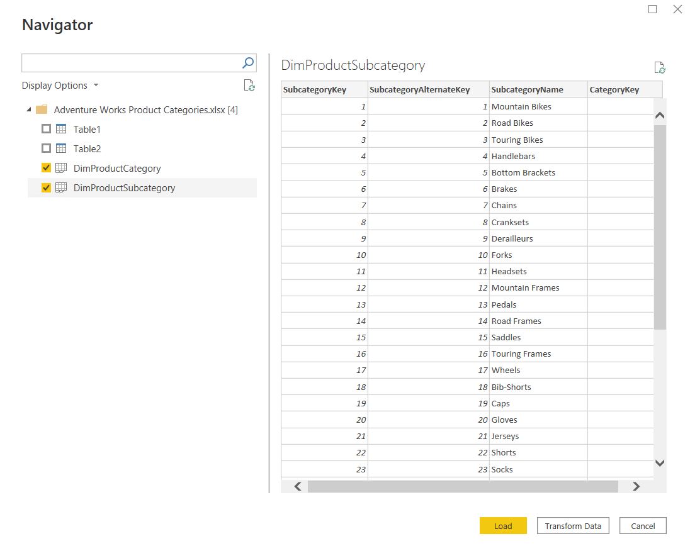

4. In the Model pane, look at the relationship that Power BI has created between the two tables.

5. Right-click the relationship line between **DimProductCategory**, and **DimProductSubcategory**, and then click **Delete**.

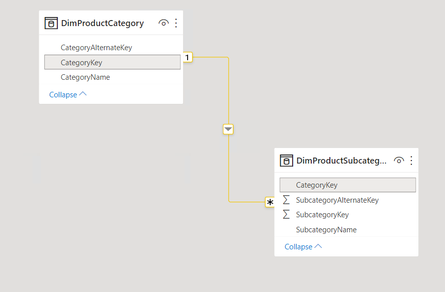

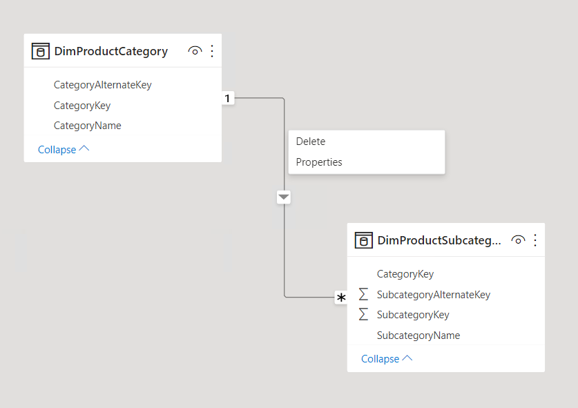

6. In the **Delete Relationship** dialog box, click **Delete**.

7. In the **DimProductSubcategory** table, drag the **CategoryKey** column to the **CategoryKey** column in the **DimProductCategory** table.

8. Double-click the relationship line between **DimProductCategory**, and **DimProductSubcategory**.

9. In the **Edit relationship** dialog box, ensure the **Cardinality** is set to a **Many to one (*:1)** relationship.

10. In the **Cross filter direction** list, click **Both**, and then click **OK**.

11. In the **DimProduct** table, drag the **ProductSubcategoryKey** column to the **SubcategoryKey** column in the **DimProductSubcategory** table, to create a **Many to one (*:1)** relationship.

12. Right-click the relationship line between **DimProductSubcategory**, and **DimProduct**, and then click Properties.

13. In the **Edit relationship** dialog box, in the **Cross filter direction** list, click **Both**, and then click **OK**.

14. On the **File** menu, click **Save**.

15. Leave Power BI Desktop open for the next exercise.

---

### Exercise 2: Calculations

#### Task 1: Adding Calculated Columns

1. In Power BI Desktop, in the views pane on the left-hand side, click **Data**.

2. In the **Data** pane, right-click **DimCustomer**, and then click **New column**.

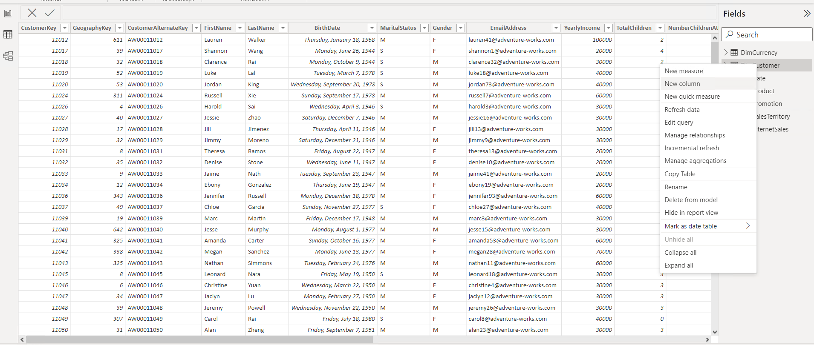

3. In the formula bar, highlight **Column =**, type the following script, and then press Enter:
    ```
    IncomeStatus = IF (DimCustomer[YearlyIncome] < 25000, "Lower Income",

    IF (AND(DimCustomer[YearlyIncome] >= 25000, DimCustomer[YearlyIncome] < 60000), "Middle Income",

    IF (AND(DimCustomer[YearlyIncome] >= 60000, DimCustomer[YearlyIncome] < 100000), "Higher Income",

    IF (DimCustomer[YearlyIncome] >= 100000, "Very High Income", "Other"))))
    ```

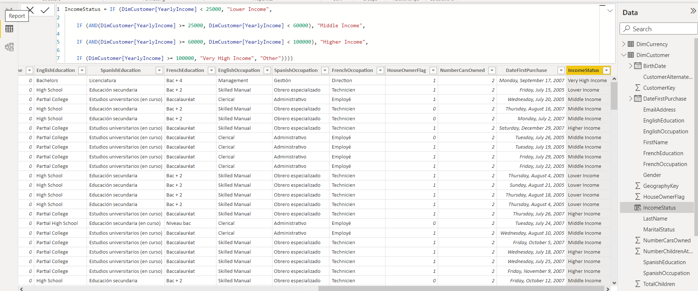

4. On the **Modeling** tab, in the **Calculations** group, click **New Column**.

5. In the formula bar, highlight **Column =**, type the following script, and then press Enter:
    ```
    DaysSinceFirstPurchase = DATEDIFF(DimCustomer[DateFirstPurchase], TODAY(), DAY)
    ```

6. On the **Modeling** tab, in the **Calculations** group, click **New Column**.

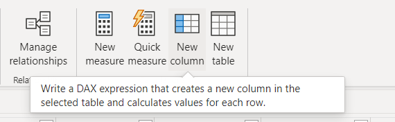

7. In the formula bar, highlight **Column =**, type the following script, and then press Enter:
    ```
    FullName = [FirstName] & " " & [LastName]
    ```

8. On the **Modeling** tab, in the **Calculations** group, click **New Column**.

9. In the formula bar, highlight **Column =**, type the following script, and then press Enter:
    ```
    MaleFemale = IF([Gender] = "M", "Male", "Female")
    ```

10. On the **Modeling** tab, in the **Calculations** group, click **New Column**.

11. In the formula bar, highlight **Column =**, type the following script, and then press Enter:
    ```
    Relationship = IF([MaritalStatus] = "M", "Married", "Single")
    ```

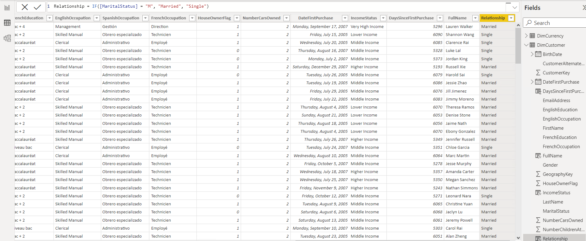

12. In the **Data** pane, right-click **DimProductSubcategory**, and then click **New column**.

13. In the formula bar, highlight **Column =**, type the following script, and then press Enter:
    ```
    MainCategory = RELATED(DimProductCategory[CategoryName])
    ```

14. In the **Data** pane, right-click **DimPromotion**, and then click **New column**.

15. In the formula bar, highlight **Column =**, type the following script, and then press Enter:
    ```
    PromotionLengthDays = DATEDIFF(DimPromotion[StartDate], DimPromotion[EndDate], DAY)
    ```

16. In the **Data** pane, right-click **FactInternetSales**, and then click **New column**.

17. In the formula bar, highlight **Column =**, type the following script, and then press Enter:
    ```
    Profit = CURRENCY(FactInternetSales[UnitPrice] - FactInternetSales[ProductStandardCost])
    ```

18. Close Power BI Desktop, saving any changes.
