# Module 6: Interactive Data Visualizations

- [Module 6: Interactive Data Visualizations](#module-6-interactive-data-visualizations)
  - [Lab: Creating a Power BI Report](#lab-creating-a-power-bi-report)
    - [Exercise 1: Connecting to Power BI Data](#exercise-1-connecting-to-power-bi-data)
      - [Task 1: Prepare the Environment](#task-1-prepare-the-environment)
      - [Task 2: Connect to Existing Data](#task-2-connect-to-existing-data)
      - [Task 3: Shape Data](#task-3-shape-data)
    - [Demo 1: Adding Visualizations to a Report](#demo-1-adding-visualizations-to-a-report)
      - [Connect to a Database in SQL Database and Import Data](#connect-to-a-database-in-sql-database-and-import-data)
      - [Add Visualizations to a Report](#add-visualizations-to-a-report)


## Lab: Creating a Power BI Report

### Exercise 1: Connecting to Power BI Data

#### Task 1: Prepare the Environment

Lab environment is already setup.

#### Task 2: Connect to Existing Data

1. On the Taskbar, click **Microsoft SQL Server Management Studio 18**.

2. In the **Connect to Server** dialog box, ensure SQL Server is set to the **localhost** database engine instance using **Windows Authentication**, and then click **Connect**.

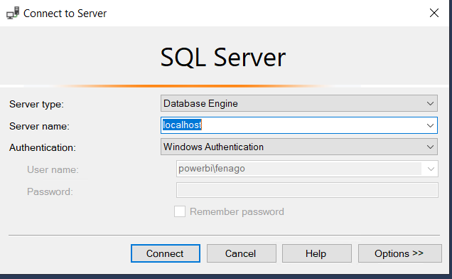

3. On the **File** menu, point to **Open**, and then click **Project/Solution**.

4. In the **Open Project** dialog box, browse to the **Desktop\\power-bi-quickstart\\Labfiles\\Lab06\\Starter\\Project** folder, and then double-click **Project.ssmssln**.

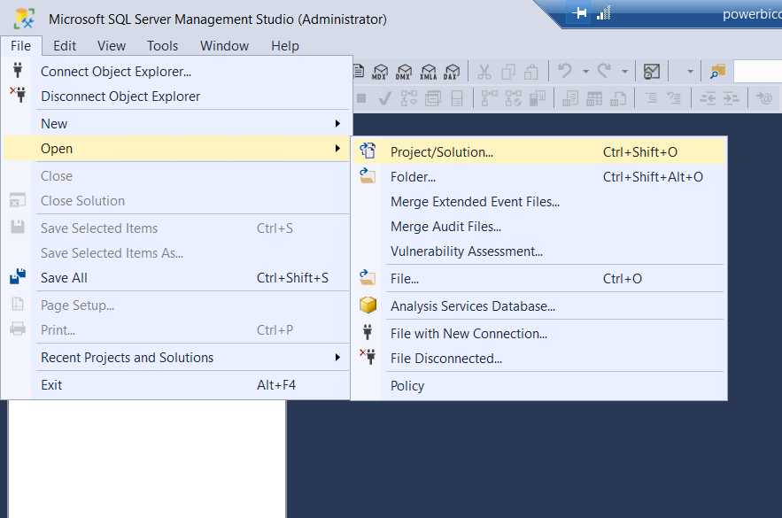

5. If Solution Explorer is not visible, on the **View** menu, click **Solution Explorer**.

6. In Solution Explorer, expand **Queries**, and then double-click **Lab Exercise 1.sql**.

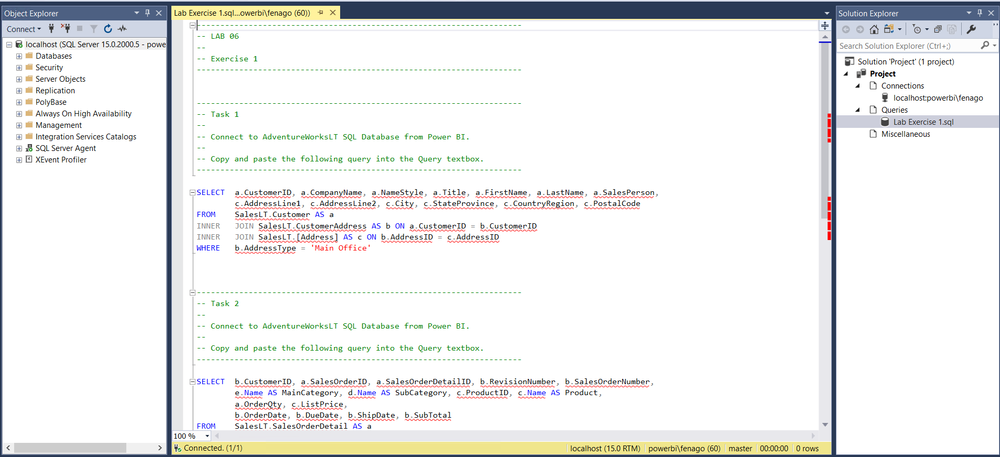

7. On the Taskbar, click **Power BI Desktop**.

8. To close the getting started window, at the top-right of the window, click **X**.

9. In the **Power BI Desktop** window, click **Get data**.

10. In the **Get Data** dialog box, click **SQL Server**, and then click **Connect**.

11. In the **SQL Server database** dialog box, type **localhost** in the **Server** box.

12. In the **Database (optional)** box, type **AdventureWorksLT**.

13. Expand the **Advanced options** box.

14. In SQL Server Management Studio, in the **Lab Exercise 1.sql** query, copy the query under **Task 1** to the clipboard.

15. In Power BI Desktop, in the **SQL statement (optional, requires database)** box, paste the query.

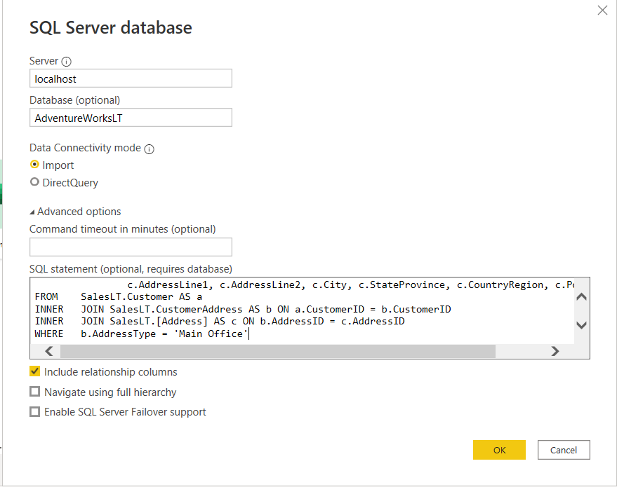

16, Click **OK**

17. In the data preview window, click **Load**.

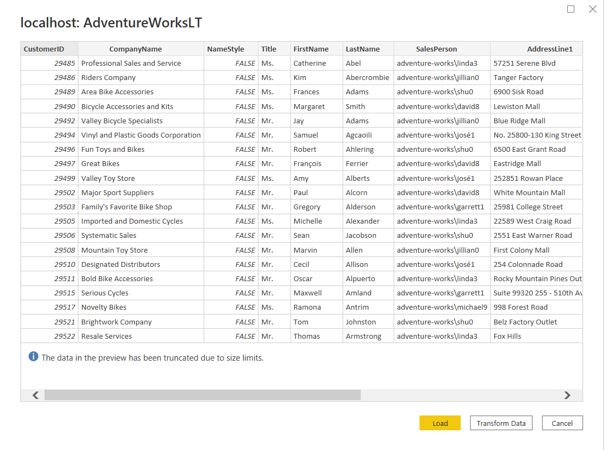

18. On the **Home** tab, click the **Get Data** arrow.

19. Click **SQL Server**, and then click **Connect**.

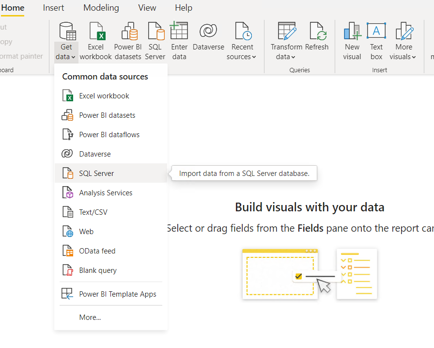

20. In the **SQL Server database** dialog box, in the **Server** box, type the URL of the server **localhost**.

21. In the **Database (optional)** box, type **AdventureWorksLT**.

22. Expand the **Advanced options** box.

23. In SQL Server Management Studio, in the **Lab Exercise 1.sql** query, copy the query under **Task 2** to the clipboard.

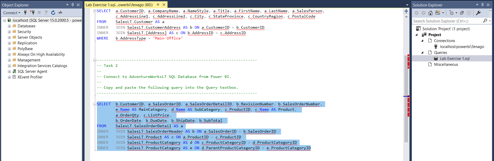

24. In Power BI Desktop, in the **SQL statement (optional, requires database)** box, paste the query, and then click **OK**.

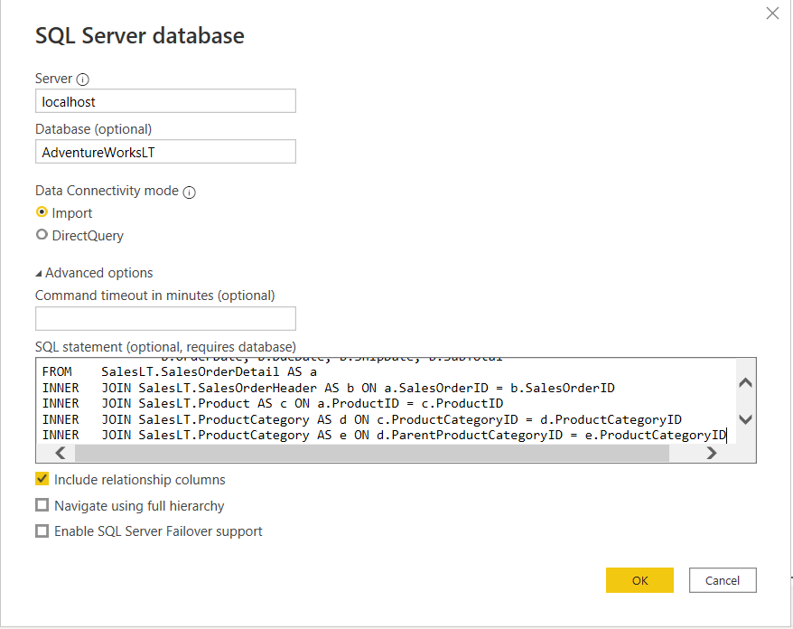

25. In the data preview window, click **Load**.

26. On the **File** menu, click **Save**.

27. In the **Save As** dialog box, navigate to **Desktop\\power-bi-quickstart\\Labfiles\\Lab06\\Starter**, in the **File name** box, type **AdventureWorksLT Sales 6.pbix**, and then click **Save**.

#### Task 3: Shape Data

1. In the **FIELDS** pane, right-click **Query1**, click **Rename**, type **Customers**, and then press Enter.

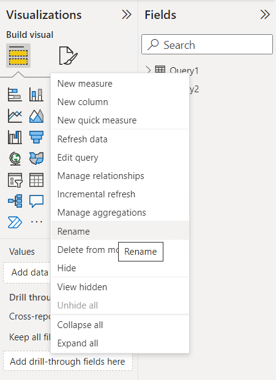

2. Right-click **Query2**, click **Rename**, type **Sales**, and then press Enter.

3. Expand the two tables to display all of the fields.

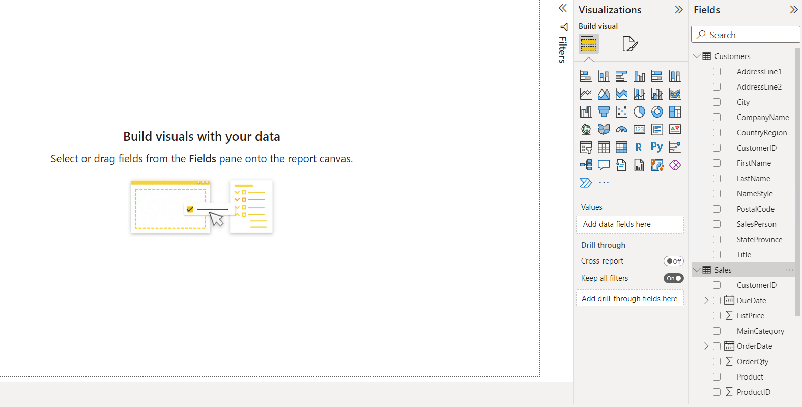

4. In the left navigation bar, click **Data**.

5. In the **FIELDS** pane, click the **Customers** table, if it is not already selected.

6. Right-click the **NameStyle** column, and click **Delete**.

7. In the **Delete column** dialog box, click **Delete**.

8. Right-click the **SalesPerson** column, and click **Delete**.

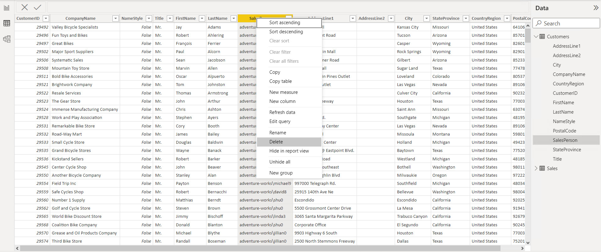

9. In the **Delete column** dialog box, click **Delete**.

10. Right-click the **CustomerID** column, and then click **Hide in report view**.

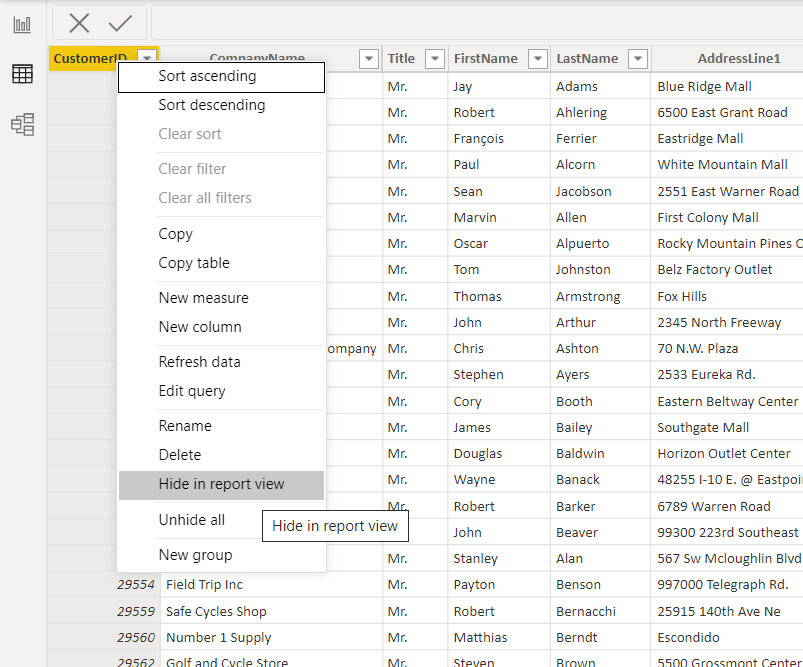

11. Click the **AddressLine1** column header.

12. On the **Modeling** tab, in the **Properties** group, click **Data Category: Uncategorized**, and then click **Address**.

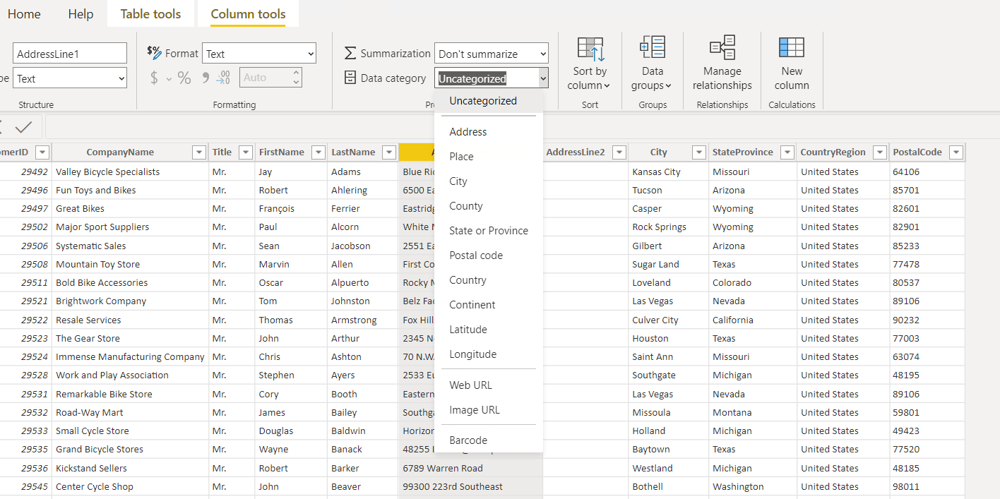

13. Click the **City** column header.

14. On the **Modeling** tab, in the **Properties** group, click **Data Category: Uncategorized**, and then click **City**.

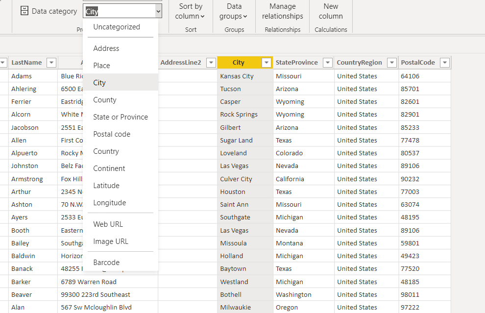

15. Click the **StateProvince** column header.

16. On the **Modeling** tab, in the **Properties** group, click **Data Category: Uncategorized**, and then click **State or Province**.

17. Click the **CountryRegion** column header.

18. On the **Modeling** tab, in the **Properties** group, click **Data Category: Uncategorized**, and then click **Country**.

19. Click the **PostalCode** column header.

20. On the **Modeling** tab, in the **Properties** group, click **Data Category: Uncategorized**, and then click **Postal Code**.

21. On the **Modeling** tab, in the **Calculations** group, click **New Column**, and then in the formula bar, type the following expression, and then press Enter:
    ```
    FullAddress = Customers[AddressLine1] & ", " & Customers[City] & ", " & Customers[StateProvince] & ", " & Customers[CountryRegion] & ", " & Customers[PostalCode]
    ```

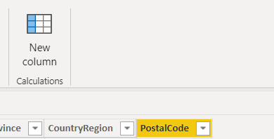

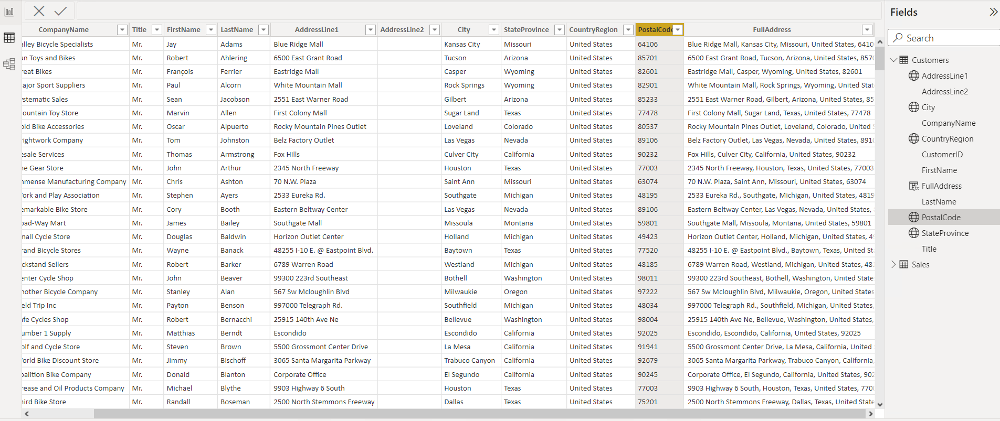

22. In the **FIELDS** pane, click **Sales**.

23. Right-click the **RevisionNumber** column, and click **Delete**.

24. In the **Delete column** dialog box, click **Delete**.

25. Right-click the **SalesOrderNumber** column, and click **Delete**.

26. In the **Delete column** dialog box, click **Delete**.

27. Right-click the **CustomerID** column, and click **Hide in report view**.

28. Right-click the **SalesOrderID** column, and click **Hide in report view**.

29. Right-click the **SalesOrderDetailID** column, and click **Hide in report view**.

30. On the **Modeling** tab, in the **Calculations** group, click **New Column**, and then in the formula bar, type the following expression, and then press Enter:
    ```
    LineTotal = Sales[OrderQty] * Sales[ListPrice]
    ```

31. Click the **LineTotal** column header.

32. On the **Modeling** tab, in the **Formatting** group, click **Format: General**, point to **Currency**, and then click **$ English (United States)**.

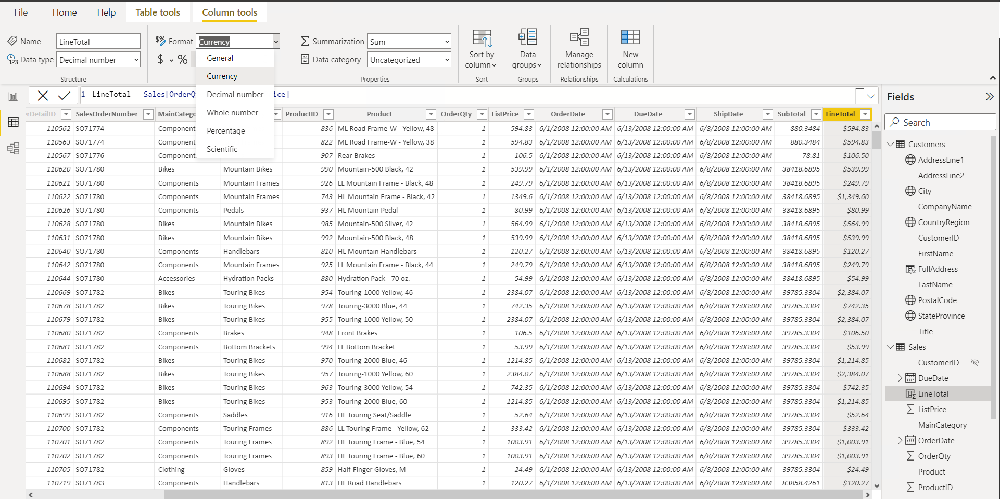

33. On the **Modeling** tab, in the **Calculations** group, click **New Measure**, and then in the formula bar, type the following expression, and then press Enter:
    ```
    TargetSales = SUM('Sales'[LineTotal]) * 1.2
    ```

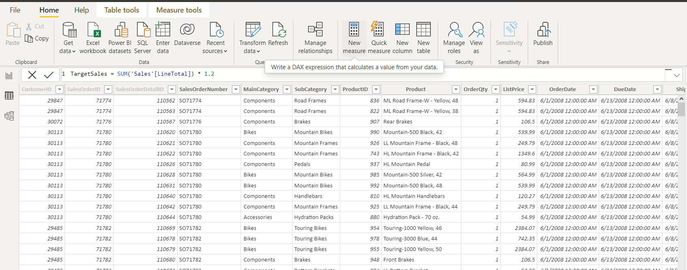

34. On the **File** menu, click **Save** and close Power BI Desktop.


### Demo 1: Adding Visualizations to a Report

#### Connect to a Database in SQL Database and Import Data

1. Open the **Desktop\\power-bi-quickstart\\Labfiles\\Lab06** folder.

2. Run **Setup.cmd** as **Administrator**.

3. When the script completes, press any key to close the window.

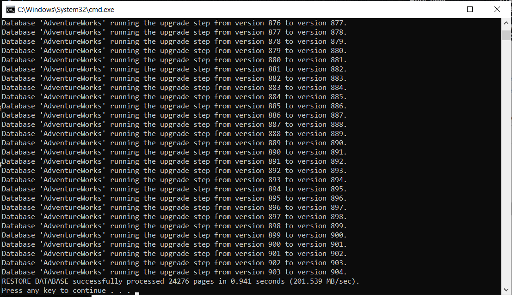

4. Start **Microsoft SQL Server Management Studio 18**, and then connect to the **localhost** database engine instance by using Windows® authentication.

5. In the **Desktop\\power-bi-quickstart\\Labfiles\\Lab06\\Demo** folder, open the **Demo.ssmssln** solution.

6. In Solution Explorer, expand **Queries**, and then open the **1 - Charts.sql** script file.

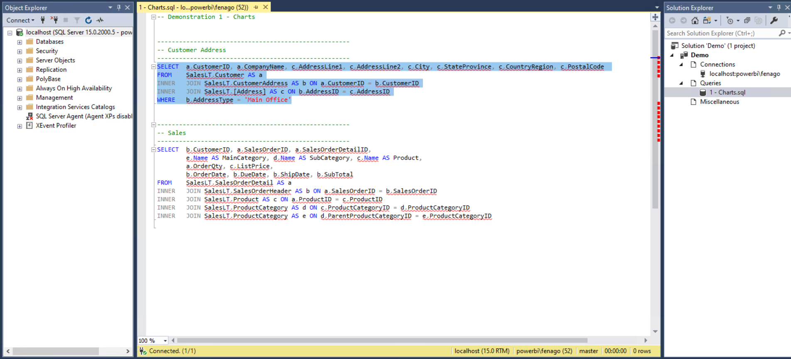

7. On the Taskbar, click **Power BI Desktop**.

8. To close the getting started window, at the top-right of the window, click **X**.

9. In the **Power BI Desktop** window, click **Get data**.

10. In the **Get Data** dialog box, click **SQL Server**.

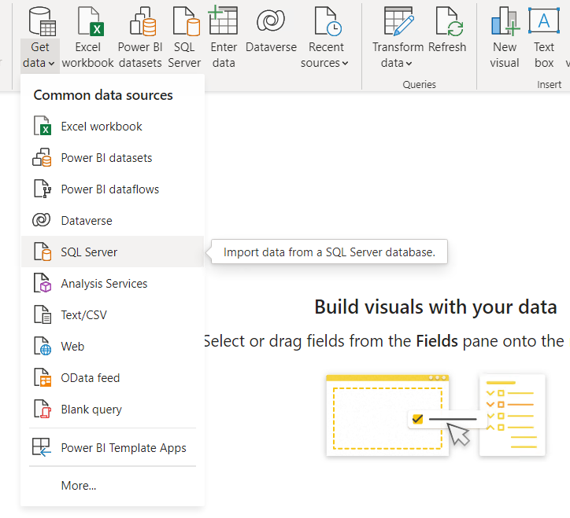

11. In the **SQL Server database** dialog box, in the **Server** box, type the URL of the server **localhost** .

12. In the **Database (optional)** box, type **AdventureWorksLT**.

13. Expand the **Advanced options** box.

14. In SQL Server Management Studio, in the **1 - Charts.sql** query, copy the query under **Customer Address** to the clipboard.

15. In Power BI Desktop, in the **SQL statement (optional, requires database)** box, paste the query, and then click **OK**.

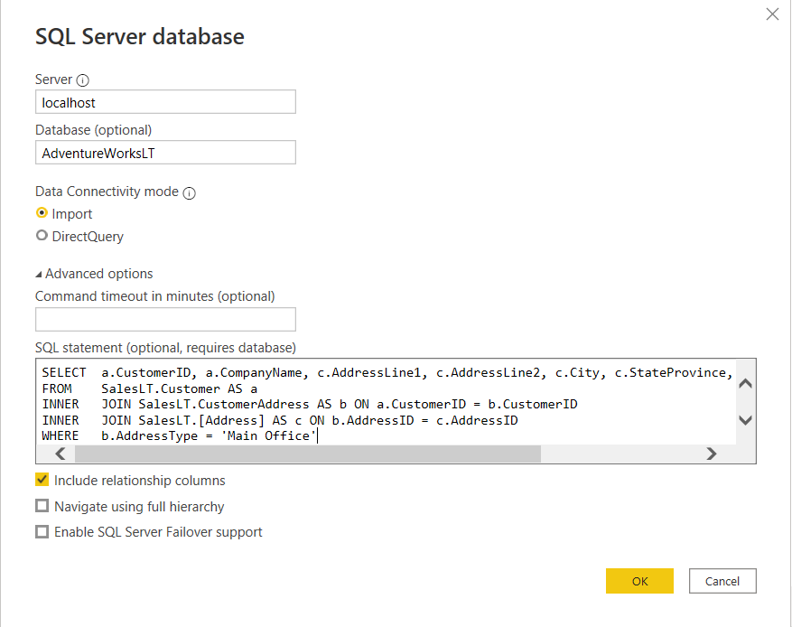

16. In the data preview window, click **Load**.

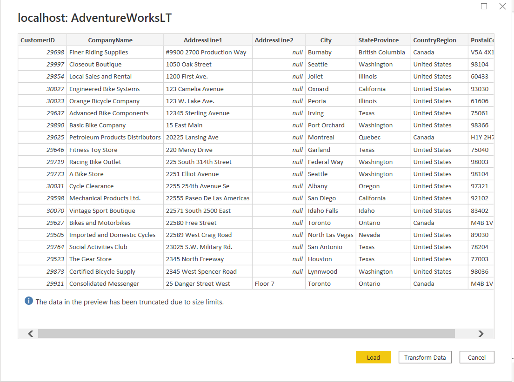

17. On the **Home** tab, click **Get Data**.

18. In the **Get Data** dialog box, click **SQL Server**.

19. In the **SQL Server database** dialog box, in the **Server** box, type the URL of the server **localhost** .

20. In the **Database (optional)** box, type **AdventureWorksLT**.

21. Expand the **Advanced options** box.

22. In SQL Server Management Studio, in the **1 - Charts.sql** query, copy the query under **Sales** to the clipboard.

23. In Power BI Desktop, in the **SQL statement (optional, requires database)** box, paste the query, and then click **OK**.

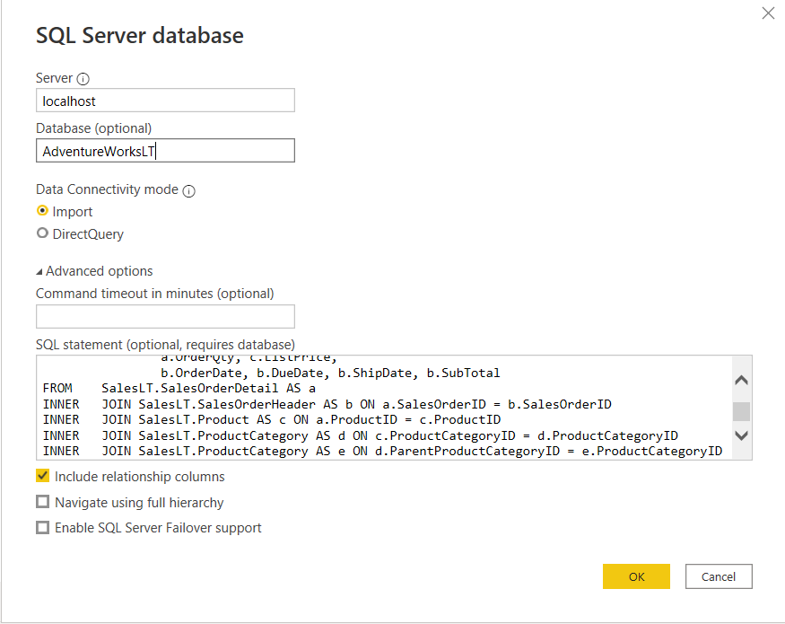

24. In the data preview window, click **Load**.

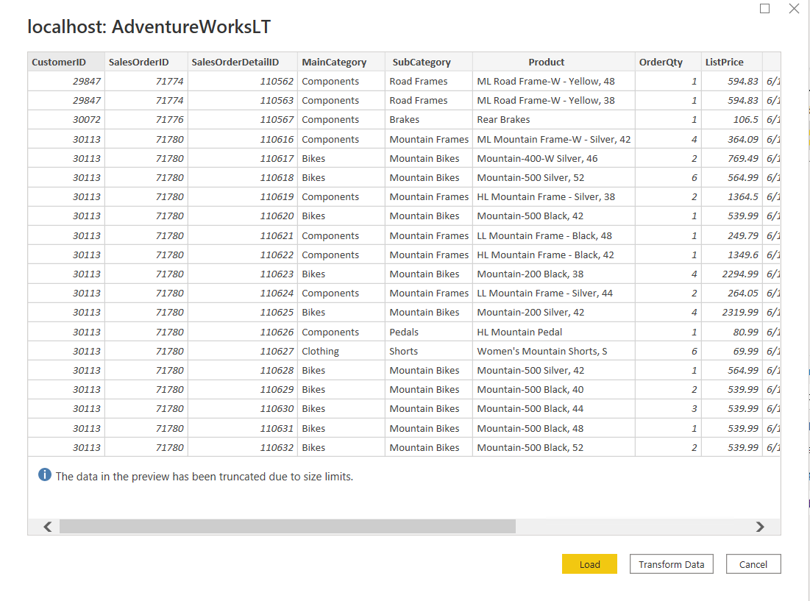

25. The window will close and return to the report.

#### Add Visualizations to a Report

1. In the **FIELDS** pane, right-click **Query1**, click **Rename**, type **Customers**, and then press Enter.

2. Right-click **Query2**, click **Rename**, type **Sales**, and then press Enter. Expand the two tables to display all the fields.

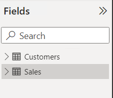

3. In the **FIELDS** pane, under **Sales**, select the **SubCategory**, and **OrderQty** check boxes. Power BI creates a table.

4. In the **VISUALIZATIONS** pane, click **Stacked column chart**.

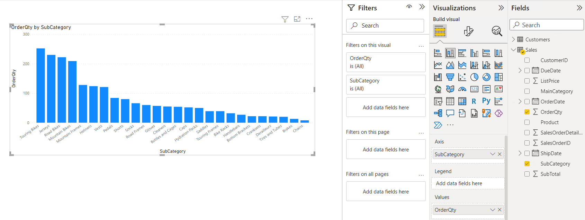

5. Grab the expander on the right edge of the chart, and then widen the chart so that all category labels are visible.

6. Ensure that the chart is still selected, and then in the **VISUALIZATIONS** pane, click **Analytics**.

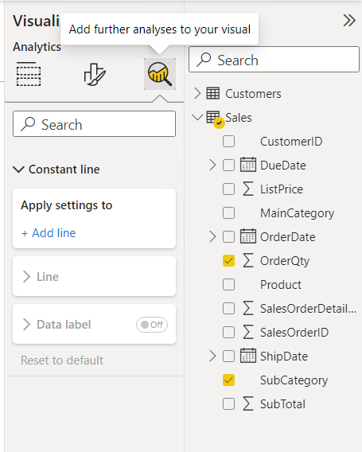

7. Expand **Constant Line**, and click **Add**.

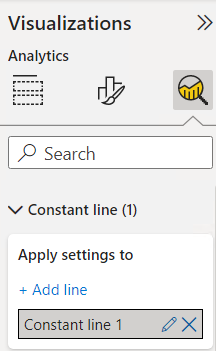

8. In the **Value** box, type **100**.

9. Change the color to **red**.

10. Toggle **Data label** to **On**.

11. Change the color to **red** to match the reference line.

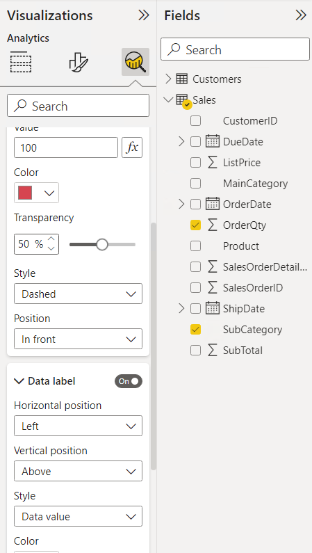

12. Click **Format**, and expand **Title**, in the **Title text** box, type **Orders by Sub Category**, and then click **Center** to align to the center.

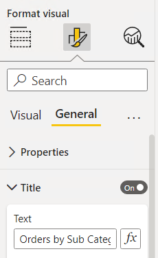

13. In the **FIELDS** pane, right-click **Sales**, and then click **New column**.

14. In the formula bar, highlight **Column =**, type the following script, and then press Enter:
    ```
    LineTotal = Sales[OrderQty] * Sales[ListPrice]
    ```

15. On the **Modeling** tab, click **Format: General**, point to **Currency**, and then click **$ English (United States)**.

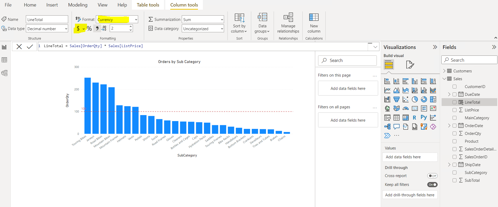

16. Click a blank area of the page.

17. In the **FIELDS** pane, under **Sales**, select the **Product** check box, which adds a table, and then select the **LineTotal** check box.

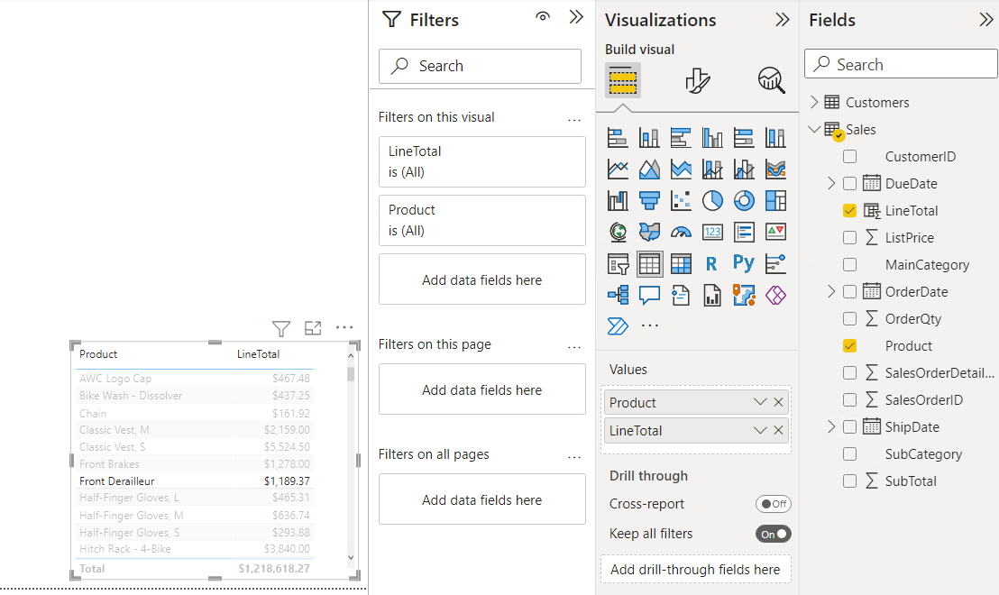

18. In the **VISUALIZATIONS** pane, click **Fields**, under **Filters**, expand **LineTotal is (All)**.

19. In the list, click **is greater than**, and in the box, type **25000**.

20. Click **Apply filter**, and then note that the number of products in the table is reduced.

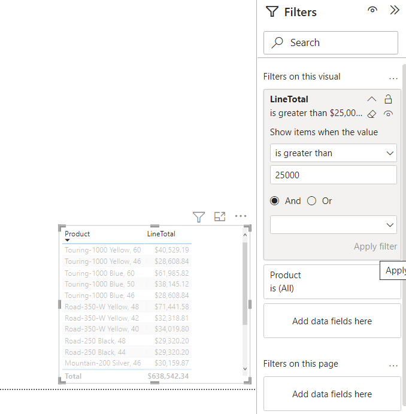

21. In the **VISUALIZATIONS** pane, click **Format**, click **Title**, and change the **Title** slider to **On**.

22. Under **Title**, in the **Title text** box, type **Product Sales Over $25k**, and then click **Center**.

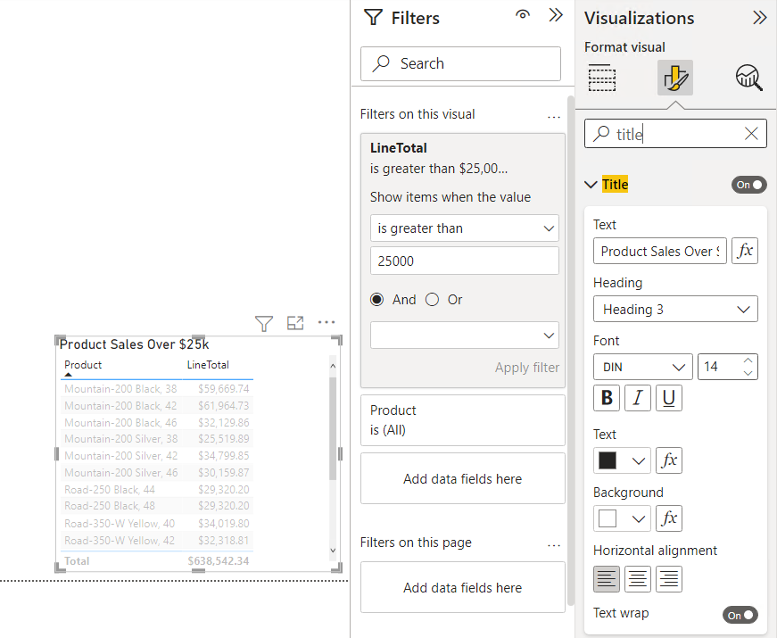

23. Select the table, and then click **Stacked bar chart**.

24. Use the expander to widen the chart to the same width as the column chart.

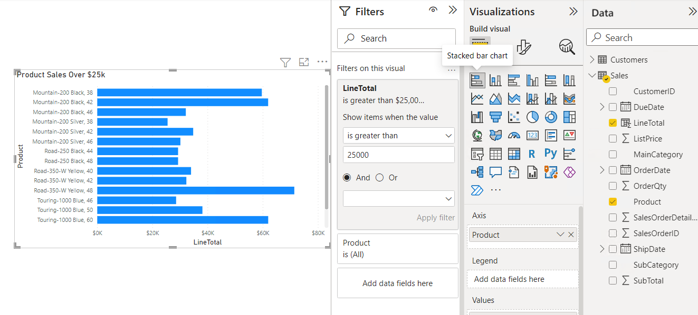

25. On the chart, click three dot icon, point to **Sort axis**, and then click **LineTotal**.

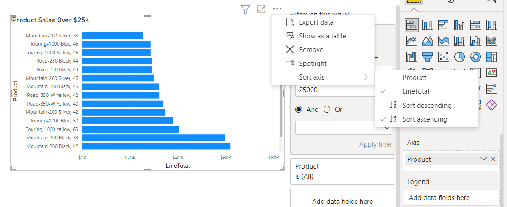

26. At the bottom of the window, click the **+** icon to add a new report.

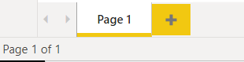

27. Click `Model` tab from the left Menu, click **Manage Relationships**, and then point out that Power BI has auto-detected the relationship on the **CustomerID** columns, and then click **Close**.

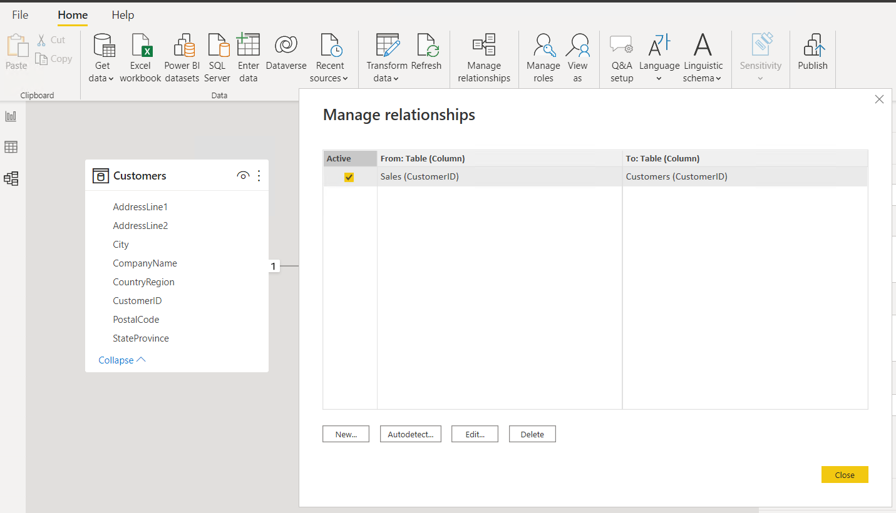

28. In the **FIELDS** pane, expand **Customers**, and then select the **City** check box. Power BI automatically adds a map chart.

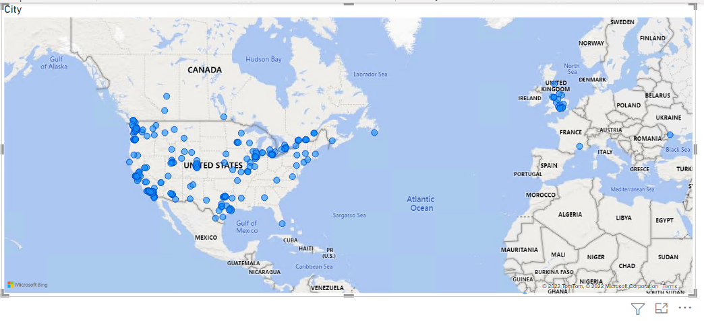

**Note:** Enable map and filled map visuals options if you get an error.

29. In the **FIELDS** pane, under **Sales**, select the **LineTotal** check box to add it to the map. Grab the right corner of the map, and then drag it to fill the whole of the report page.

30. Zoom in on the map to focus on any place. Point out that the bubbles now represent the sales for each customer, and are proportionately sized. Position the cursor over some of the bubbles to display the data labels.

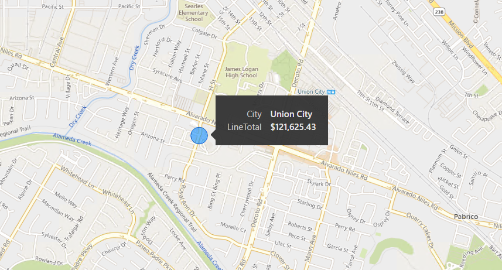

31. Close Power BI Desktop, and then close SQL Server Management Studio without saving any changes.
