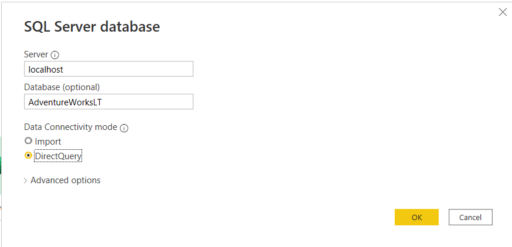
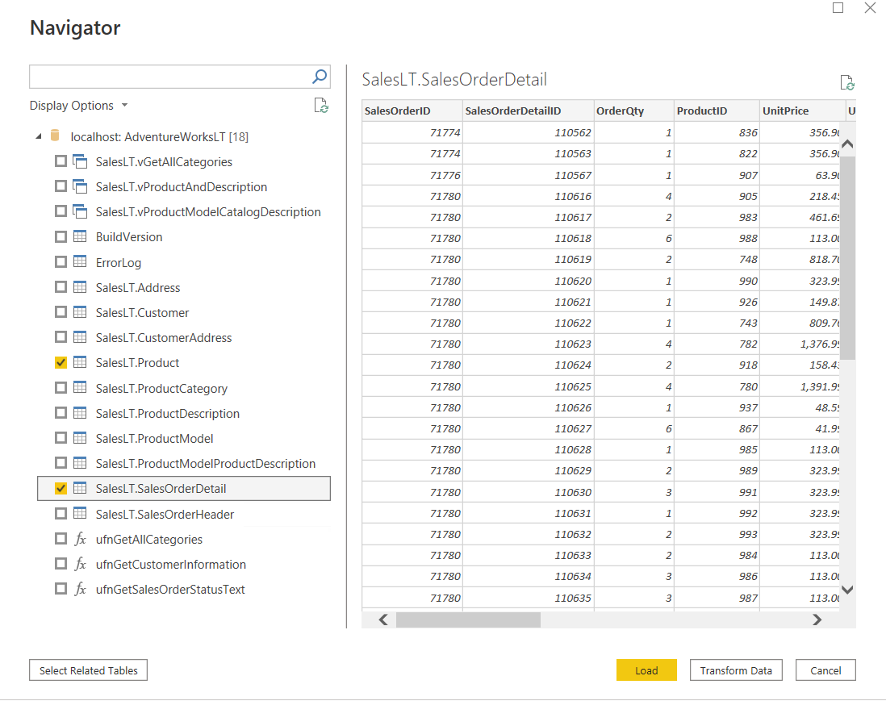
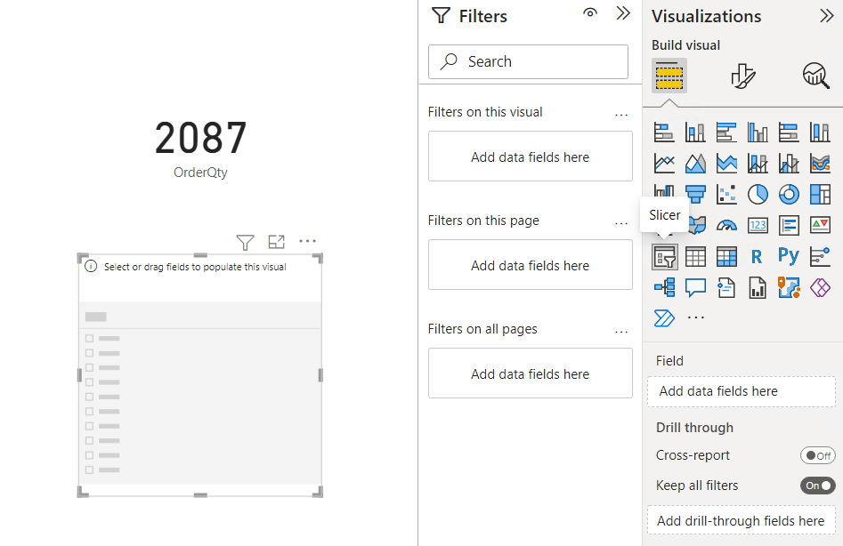
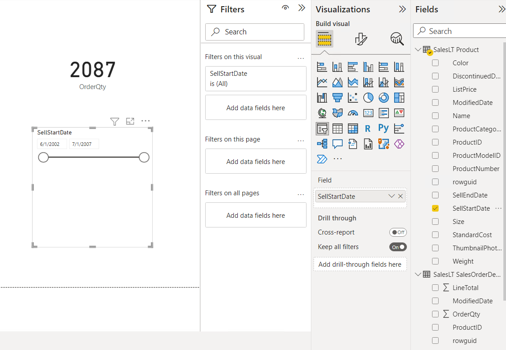
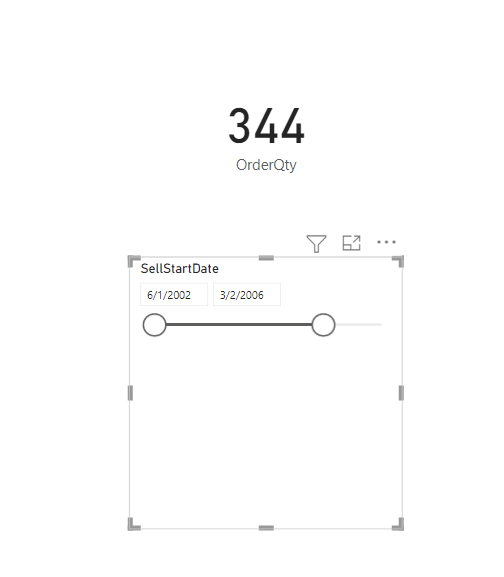

# Module 7: Direct Connectivity

- [Module 7: Direct Connectivity](#module-7-direct-connectivity)
  - [Lab: Direct connectivity](#lab-direct-connectivity)
    - [Exercise 1: Direct connections in Power BI](#exercise-1-direct-connections-in-power-bi)
      - [Task 1: Prepare the lab environment](#task-1-prepare-the-lab-environment)
      - [Task 2: Direct connectivity from the Power BI Desktop](#task-2-direct-connectivity-from-the-power-bi-desktop)

## Lab: Direct connectivity

### Exercise 1: Direct connections in Power BI

#### Task 1: Prepare the lab environment

Lab environment is already setup.

#### Task 2: Direct connectivity from the Power BI Desktop

1. On the Taskbar, click **Power BI Desktop**.

2. To close the getting started window, at the top-right of the window, click **X**.

3. In the **Power BI Desktop** window, click **Get data**.

4. In the **Get Data** dialog box, click **SQL Server**, and then click **Connect**.

5. In the **SQL Server database** window, in the **Server** box, type the URL of the server **localhost** .

6. In the **Database (optional)** box, type **AdventureWorksLT**.

7. Under **Data Connectivity mode**, click **DirectQuery**, and then click **OK**.

8. In the **Navigator** dialog box, select the **SalesLT.Product** and **SalesLT.SalesOrderDetail** check boxes, and then click **Load**.

9. In the **Visualizations** pane, click the **Card** icon.

10. In the **Fields** pane, expand the **SalesLT SalesOrderDetail** table, and drag the **OrderQty** field to the chart.

11. Click the canvas, to ensure that the Card chart is not active.

12. In the **Visualizations** pane, click the **Slicer** icon.

13. In the **Fields** pane, expand the **SalesLT Product** table, and drag the **SellStartDate** field to the chart.

14. Drag the slider bar to reduce the date range, and verify that the **OrderQty** value changes.

15. On the **File** menu, click **Save**.

16. In the **Save As** dialog box, go to the **Desktop\\power-bi-quickstart\\Labfiles\\Lab07\\Starter** folder, in the **File name** box, type **Sales Orders**, and then click **Save**.
