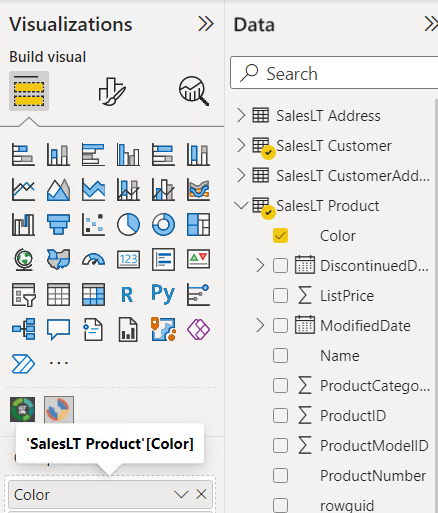
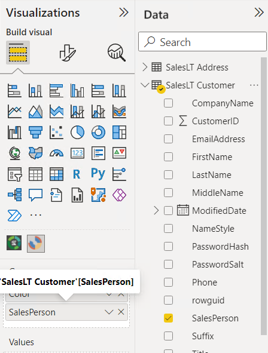

# Module 8: The Developer API Development with Power BI

- [Module 8: The Developer API Development with Power BI](#module-8-the-developer-api-development-with-power-bi)
  - [Lab: Using Marketplace Visualizations](#lab-using-marketplace-visualizations)
    - [Exercise 1: Use a Custom Visualization](#exercise-1-use-a-custom-visualization)
      - [Task 1: Prepare the Lab Environment](#task-1-prepare-the-lab-environment)
      - [Task 2: Using Custom Visuals](#task-2-using-custom-visuals)

**Note:** Lab Solution is present in `D:\Labfiles\Lab08\Solution` folder:

## Lab: Using Marketplace Visualizations

### Exercise 1: Use a Custom Visualization

#### Task 1: Prepare the Lab Environment

1. Ensure that you have copied all folders from `Desktop/power-bi-quickstart` folder into **D:\\** drive before starting the lab.

2. In the **D:\\Labfiles\\Lab08\\Starter** folder, right-click **Setup.cmd**, and then click **Run as administrator**.

3. In the **User Account Control** dialog box, click **Yes**.

4. If prompted to continue this operation, type **Y**, and then press Enter.

5. When the script completes, press any key to close the window.

#### Task 2: Using Custom Visuals

1. On the Taskbar, click **Power BI Desktop**.

3. To close the getting started window, at the top-right of the window, click **X**.

5. In the **Power BI Desktop** window, click **Open other reports**.

6. In the **Open** dialog box, browse to **D:\\Labfiles\\Lab08\\Starter\\Project**, click **Adventure Works Sales.pbix**, and then click **Open**.

7. Click **Sunburst**.

8. Drag **Color** from *SalesLT Product* in **Group**.

9. Drag **SalesPerson** from *SalesLT Customer* in **Group**.

9. Drag **OrderQty** from *SalesLT SalesOrderDetails* in **Values**.

10. After making all the changes, config should ike this this:

10. You should get following visual:

14. Close Power BI Desktop, without saving any changes.
