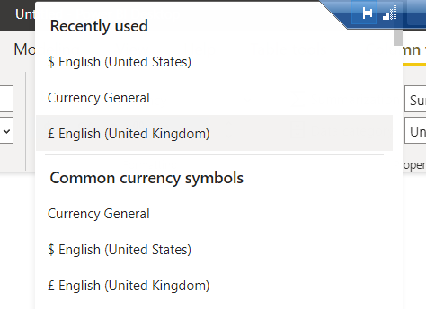
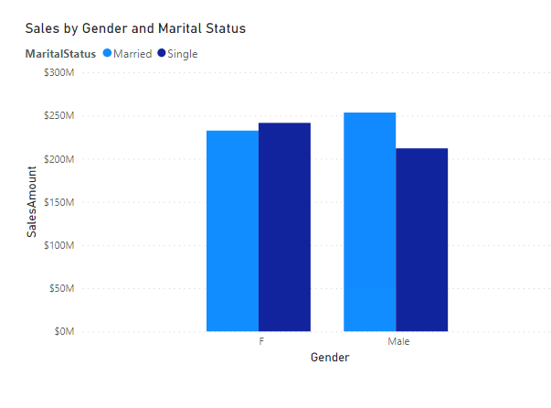

# Module 1: Introduction to Self-Service BI Solutions

- [Module 1: Introduction to Self-Service BI Solutions](#module-1-introduction-to-self-service-bi-solutions)
  - [Lesson 2: Introduction to Data Analysis](#lesson-2-introduction-to-data-analysis)
    - [Demo 1: Importing Data with Power BI Desktop](#demo-1-importing-data-with-power-bi-desktop)
  - [Lesson 3: Introduction to Data Visualization](#lesson-3-introduction-to-data-visualization)
    - [Demo 1: Visualizing Data with Power BI Desktop](#demo-1-visualizing-data-with-power-bi-desktop)

## Lesson 2: Introduction to Data Analysis

### Demo 1: Importing Data with Power BI Desktop

6. On the desktop, double-click **Power BI Desktop**.

7. Click **New** > **Report**:

8. On the **Power BI Desktop** screen, click **Get data**.

9. In the **Get Data** dialog box, click **SQL Server**, and then click **Connect**.

10. In the **SQL Server** dialog box, in the **Server** box, type **localhost**.

11. In the **Database (optional)** box, type **AdventureWorksDW**, and then click **OK**.

12. In the **SQL Server** dialog box, leave the default settings unchanged, and then click **Connect**.

13. In the **Encryption Support** dialog box, click **OK**.

14. In the **Navigator** dialog box, select the **FactInternetSales** check box.

15. Click **Select Related Tables**, and then click **Transform Data**.

16. If the **Connection Settings** dialog box appears, leave **Import** selected, and then click **OK**.

17. In the **Power Query Editor** window, in the **Queries** pane, click **FactInternetSales**.

18. Right-click the **CarrierTrackingNumber** column, and click **Remove**.

19. Right-click the **CustomerPONumber** column, and click **Remove**.

20. In the **Queries** pane, click **DimCustomer**.

21. Right-click the **Title** column, and click **Remove**.

22. Right-click the **NameStyle** column, and click **Remove**.

23. Right-click the **Suffix** column, and click **Remove**.

24. Right-click the **MaritalStatus** column, and click **Replace Values**.

25. In the **Replace Values** dialog box, in the **Value To Find** box, type **M**.

26. In the **Replace With** box, type **Married**, and then click **OK**.

27. Right-click the **MaritalStatus** column, and click **Replace Values**.

28. In the **Replace Values** dialog box, in the **Value To Find** box, type **S**.

29. In the **Replace With** box, type **Single**, and then click **OK**.

30. Right-click the **Gender** column, and click **Replace Values**.

31. In the **Replace Values** dialog box, in the **Value To Find** box, type **F**.

32. In the **Replace With** box, type **Female**, and then click **OK**.

33. Right-click the **Gender** column, and click **Replace Values**.

34. In the **Replace Values** dialog box, in the **Value To Find** box, type **M**.

35. In the **Replace With** box, type **Male**, and then click **OK**.

36. On the **Home** menu, click **Close & Apply**.

37. Wait until the data has successfully loaded.

38. In the **Data** pane, expand **FactInternetSales**, and then click **SalesAmount**.

**Note:** If you don't see data in the **Date** pane, make sure to save above changes using query editor.

39. On the **Modeling** tab, in the **Formatting** group, click **Format: Currency general**, point to **Currency**, and then click **$ English (United States)**.

40. In the **Data** pane, right-click **DimCustomer**, and then click **New column**.

41. In the formula bar, type **FullName = DimCustomer[FirstName] & " " & DimCustomer[LastName]**, and then press Enter.

42. On the **File** menu, click **Save**. Name the file **Adventure Works Sales**, and save the file to **Desktop\\power-bi-quickstart\\Demofiles\\Mod01**.

43. Leave Power BI Desktop open for the next demonstration.

---

## Lesson 3: Introduction to Data Visualization

### Demo 1: Visualizing Data with Power BI Desktop

1. In Power BI Desktop, In the **Data** pane, under **DimCustomer**, select **Gender**, and **MaritalStatus**.

2. Under **FactInternetSales**, select **SalesAmount**.

3. In the **VISUALIZATIONS** pane, click **Clustered column chart**. 

4. Click **Format**, expand **Title**, and then change the **Title text** to **Sales by Gender and Marital Status**.

5. Change **Alignment** to **Center**.

6. In the **Data** pane, expand **DimProduct**, and drag the **Color** field onto the report canvas to create a new table.

7. Under **FactInternetSales**, drag the **OrderQuantity** field onto the new table.

8. In the **VISUALIZATIONS** pane, click **Donut chart**.

9. Click **Format**, and then expand **Title**.

10. Change the **Title text** to **Orders by Color**.

11. Change **Alignment** to **Center**.

12. In the **Data** pane, under **FactInternetSales**, drag the **SalesAmount** field onto the report canvas to create a new column chart.

13. In the **VISUALIZATIONS** pane, click **Data**.

14. In the **Data** pane, expand **DimDate**, and drag the **EnglishMonthName** to the **X-axis** property.

15. Grab the resizer on the column chart to widen the chart so that the month names display clearly.

16. In the **VISUALIZATIONS** pane, click **Format**, and then expand **Title**.

17. Change the **Title text** to **Sales by Month**.

18. Change **Alignment** to **Center**.

19. On the **File** menu, click **Save**.

