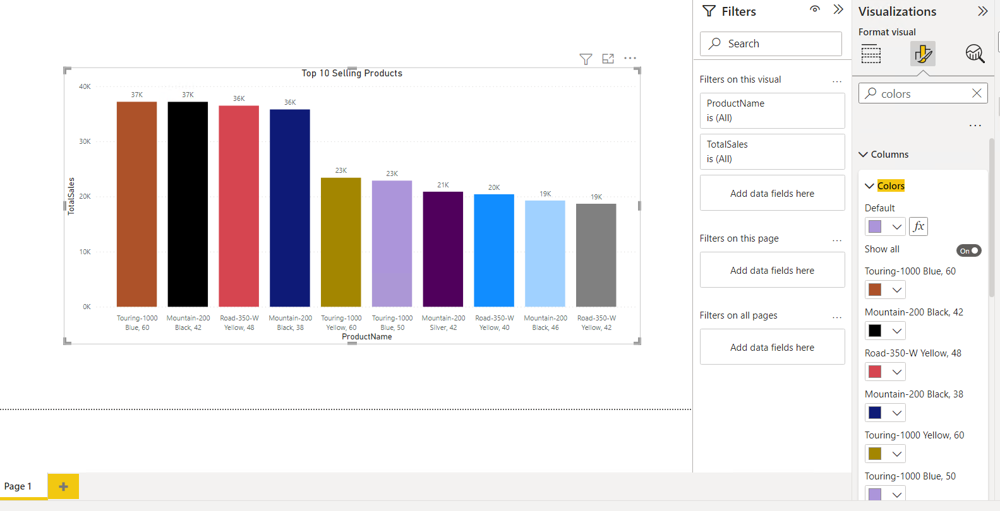

# Module 2: Introducing Power BI

- [Module 2: Introducing Power BI](#module-2-introducing-power-bi)
  - [Lesson 1: Power BI](#lesson-1-power-bi)
    - [Demo 1: Creating a Report with Power BI Desktop](#demo-1-creating-a-report-with-power-bi-desktop)

## Lesson 1: Power BI

### Demo 1: Creating a Report with Power BI Desktop

1. Ensure that you have copied all folders from `Desktop/power-bi-quickstart` folder into **D:\\** drive before starting the lab.

2. In the **D:\\Demofiles\\Mod02** folder, run **Setup.cmd** as Administrator.

3. In the **User Account Control** dialog box, click **Yes**.

4. If prompted to continue this operation, type **Y**, and then press Enter.

5. When the script completes, press any key to close the window.

6. Start **Microsoft SQL Server Management Studio 18**, and connect to the **localhost** database engine instance using Windows authentication.

7. Open the **Demo.ssmssln** solution in the **D:\\Demofiles\\Mod02\\Demo** folder.

8. In Solution Explorer, expand **Queries**, and then open the **1 - Power BI.sql** script file.

9. On the Taskbar, click **Power BI Desktop**.

10. To close the getting started window, at the top-right of the window, click **X**.

13. In the **Power BI Desktop** window, click **Get data**.

14. In the **Get Data** dialog box, click **SQL Server**, and then click **Connect**.

15. In the **SQL Server database** window, in the **Server** box, type the URL of the server **localhost**, and in the **Database (optional)** box, type **AdventureWorksLT**.

16. Expand **Advanced options**.

17. In SQL Server Management Studio, copy the **1 - Power BI.sql** query to the clipboard.

18. In the Power BI Desktop, in the **SQL statement (optional, requires database)** box, paste the query, and then click **OK**.

22. In the data preview window, click **Load**.

23. If the **Connection Settings** window appears, leave **Import** selected, and then click **OK**.

24. In the **VISUALIZATIONS** pane, click **Stacked column chart**.

25. In the **FIELDS** pane, under **Query1**, select the **ProductName** and **TotalSales** check boxes. The chart will auto populate. Expand the chart control to horizontally show the full names of the products.

26. In the **VISUALIZATIONS** pane, click **Format**.

27. Expand **Title**, and change the **Title text** value to **Top 10 Selling Products**.

28. Next to **Alignment**, click the **Center** icon.

29. Toggle **Data labels** to be **On**.

30. Expand the **Colors** list, and choose another color to change the bars on the chart.

31. On the **File** menu, click **Save As**. Name the report **Adventure Works Sales 2**, and save to the **D:\\Demofiles\\Mod02\\Demo** folder.
