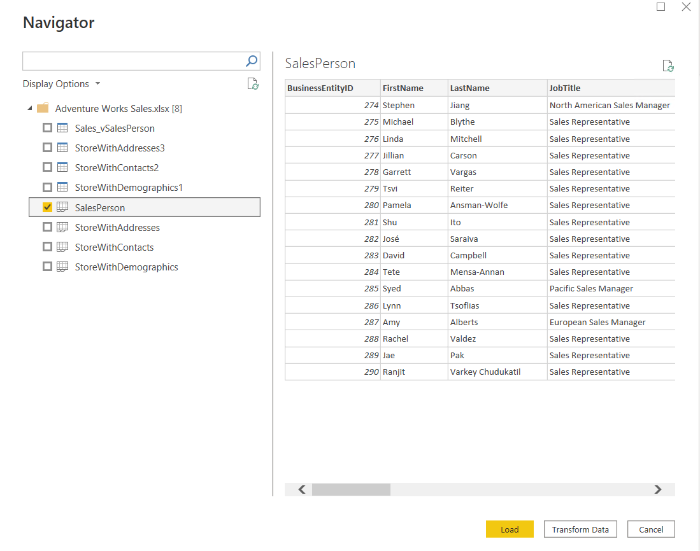

# Module 3: Power BI Data

- [Module 3: Power BI Data](#module-3-power-bi-data)
  - [Lesson 1: Using Excel as a Data Source for Power BI](#lesson-1-using-excel-as-a-data-source-for-power-bi)
    - [Demo 1: Importing Files from a Local Folder](#demo-1-importing-files-from-a-local-folder)
      - [Import Data from an Excel File](#import-data-from-an-excel-file)
      - [Import Data from a CSV File](#import-data-from-a-csv-file)
  - [Lesson 2: Using Databases as a Data Source for Power BI](#lesson-2-using-databases-as-a-data-source-for-power-bi)
    - [Demo 1: Importing Data from SQL Server](#demo-1-importing-data-from-sql-server)
      - [Import Data from SQL Server](#import-data-from-sql-server)
      - [Import Data Using a Query](#import-data-using-a-query)

## Lesson 1: Using Excel as a Data Source for Power BI

### Demo 1: Importing Files from a Local Folder

#### Import Data from an Excel File

6. On the taskbar, click **Power BI Desktop**.

7. To close the getting started window, at the top-right of the window, click **X**.

8. In the **Power BI Desktop** window, click **Get data**.

9. In the **Get Data** dialog box, click **Excel**, and then click **Connect**.

10. In the **Open** dialog box, navigate to **Desktop\\power-bi-quickstart\\Demofiles\\Mod03\\Demo**, click **Adventure Works Sales.xlsx**, and then click **Open**.

11. In the **Navigator** window, click **SalesPerson** to show a preview of the data. Use the horizontal scrollbar to display the columns, select the **SalesPerson** check box, and then click **Load**.

#### Import Data from a CSV File

1. On the **Home** tab, click **Get Data**.

2. In the **Get Data** dialog box, click **Text/CSV**, and then click **Connect**.

3. In the **Open** dialog box, navigate to **Desktop\\power-bi-quickstart\\Demofiles\\Mod03\\Demo**, click **Adventure Works Sales.csv**, and then click **Open**.

4. In the preview window, drag the lower-right corner to enlarge the window and display more of the data, and then click **Load**.

5. In the **FIELDS** pane, expand the **Adventure Works Sales** table to show the columns. Mention that the two tables from different sources are now available to use together in a report.

6. On the **File** menu, click **Save As**, name the report **Adventure Works Sales 3**, and then save to the **Desktop\\power-bi-quickstart\\Demofiles\\Mod03\\Demo** folder.

7. Leave Power BI open for the next demonstration.

---

## Lesson 2: Using Databases as a Data Source for Power BI

### Demo 1: Importing Data from SQL Server

#### Import Data from SQL Server

1. On the **Home** tab, click the **Get Data** arrow, and then click **SQL Server**.

2. In the **SQL Server database** dialog box, in the **Server** box, type **localhost**, in the **Database (optional)** box, type **AdventureWorks**, and then click **OK**.

3. If the **Encryption Support** dialog box appears, click **OK**.

4. In the **Navigator** window, select the **Sales.vSalesPerson** and **Sales.vStoreWithDemographics** check boxes, and then click **Load**.

5. If the **Connection settings** window appears, ensure **Import** is selected, and then click **OK**.

#### Import Data Using a Query

1. On the **Home** tab, click the **Get Data** arrow, and then click **SQL Server**.

2. In the **SQL Server database** dialog box, in the **Server** box, type **localhost**, in the **Database (optional)** box, type **AdventureWorks**.

3. Expand **Advanced options**, and in the **SQL statement (optional, required database)** box, type **SELECT * FROM [Production].[Product]**, and then click **OK**.

4. In the **localhost: AdventureWorks** window, a preview of the data is displayed, and then click **Transform Data**.

5. In Power Query Editor, in the **ProductSubcategoryID** column, click the filter icon, and then click **Remove Empty**.

6. In the **Queries** pane, right-click **Query1**, click **Rename**, type **Products**, and then click **Close & Apply**.
