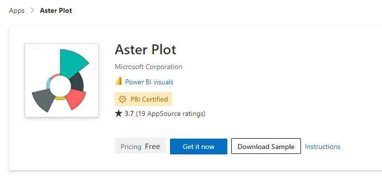
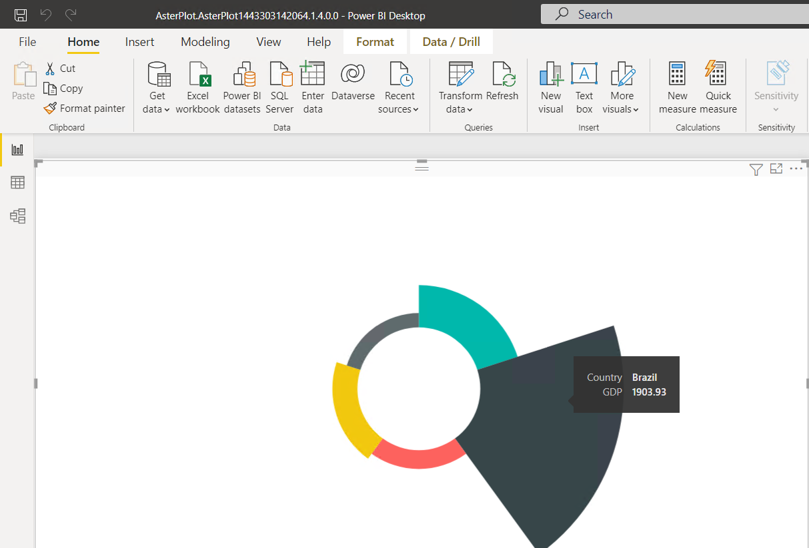
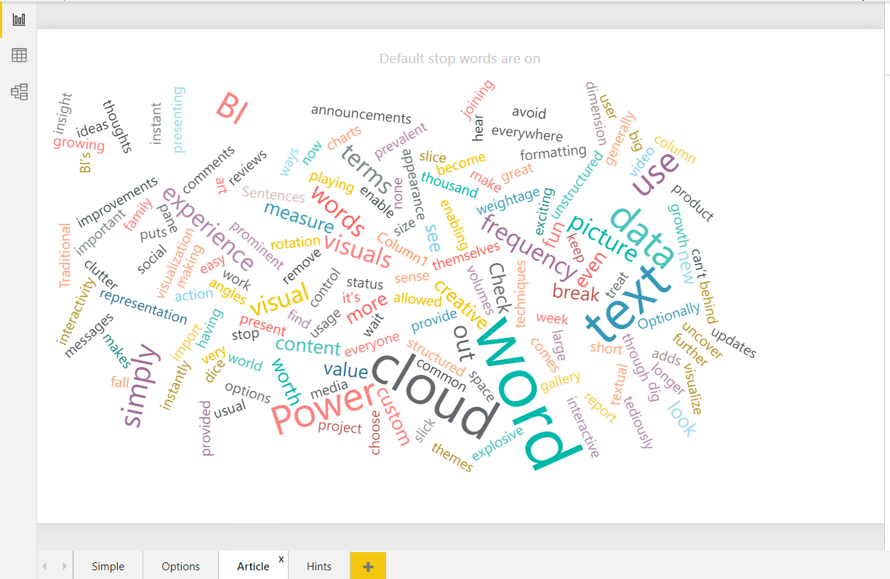

# Module 8: The Developer API Development with Power BI

- [Module 8: The Developer API Development with Power BI](#module-8-the-developer-api-development-with-power-bi)
  - [Lesson 1: Microsoft Power BI Samples](#lesson-1-microsoft-power-bi-samples)

## Lesson 1: Microsoft Power BI Samples

1. Log on to **sql server** as **powerbi\\fenago**.

2. In Chrome, go to **https://appsource.microsoft.com/en-us/product/power-bi-visuals/wa104380759?tab=overview**.

3. Click **Download Sample**:

9. On the Taskbar, click **Power BI Desktop**.

10. To close the getting started window, at the top-right of the window, click **X**.

13. In the **Power BI Desktop** window, click **Open other reports**.

14. In the **Open** dialog box, browse to **Downloads**, select downloaded pbix file, and then click **Open**.

2. In Chrome, go to **https://appsource.microsoft.com/en-us/product/power-bi-visuals/WA104380752?tab=Overview**

3. Click **Download Sample**:

13. In the **Power BI Desktop** window, click **Open other reports**.

14. In the **Open** dialog box, browse to **Downloads**, select downloaded pbix file, and then click **Open**.

15. Click on **Article** tab:

4. Close Power BI Desktop, without saving any changes, and then close Internet Explorer.
