# Restore SQl Server Databases

1. Open Management Studio by clicking following icon as shown below:

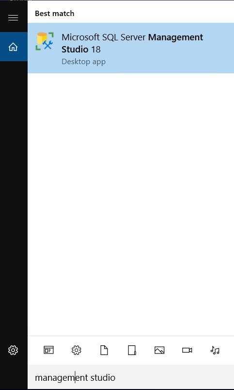

2. Management Studio will take some time to open.

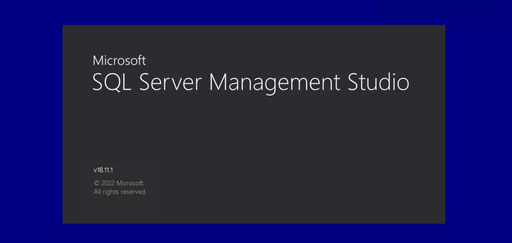

3. Enter `localhost` in Server name field and click **Connect**:

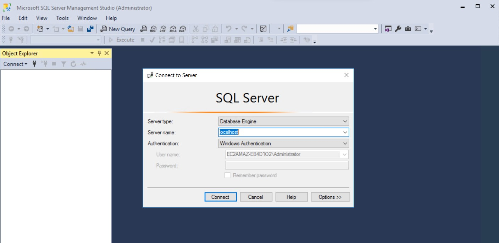

4. After successful connection, you will be able see existing databases:

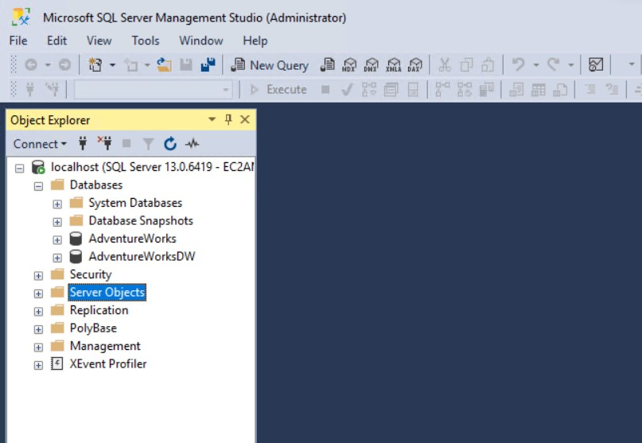

5. **Optional** You can delete databases `AdventureWorks` and `AdventureWorksDW` by right clicking and select **delete** option: 

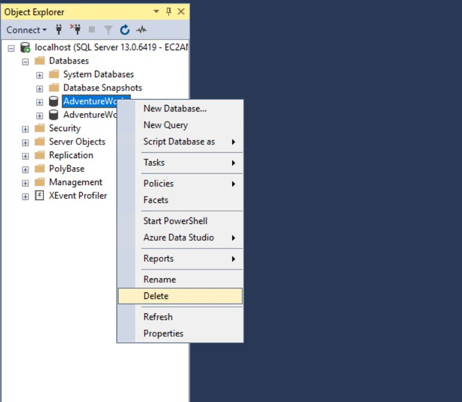

6. Click **OK** to delete database: 

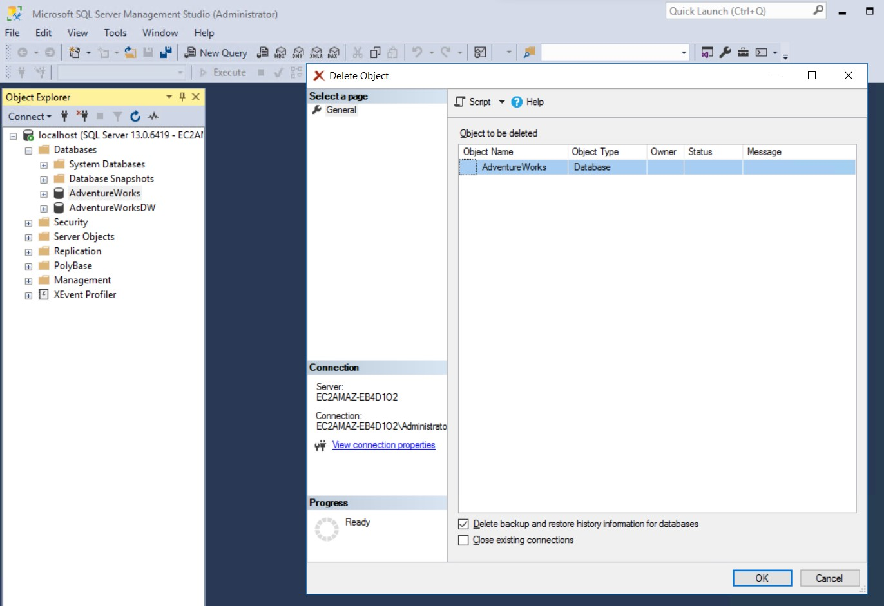

7. Right click **Database** in the menu and select **Restore Database** option: 

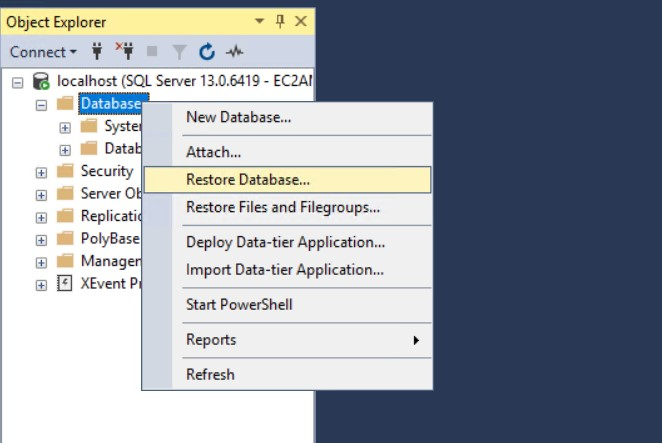

8. Select **Device** checkbox and then click `...` icon to select file path:

Database Backup Path: `C:\Setupfiles\Setupfiles`

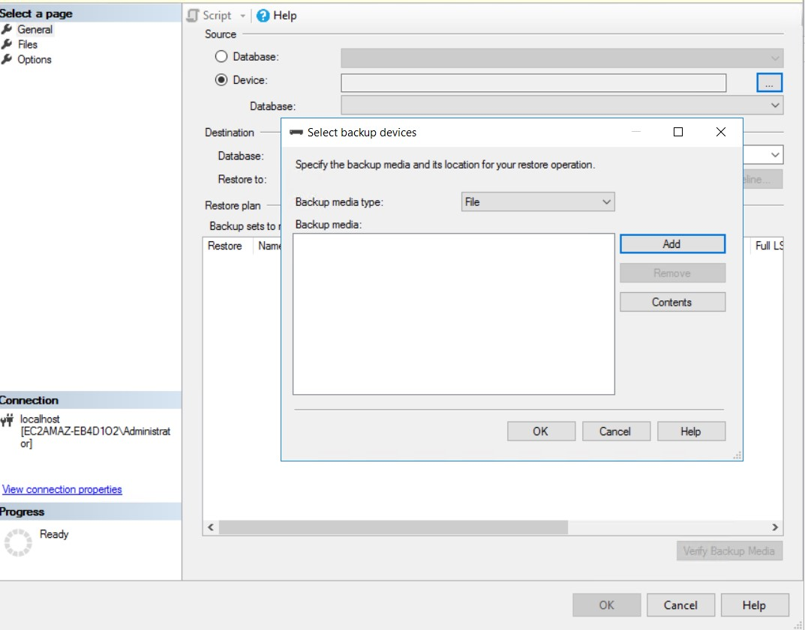

9. Click **Add** button and select path `AdventureWorks.bak`:

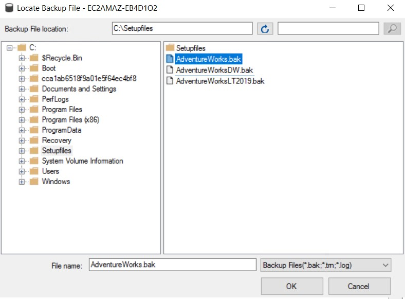

10. Click **OK**: 

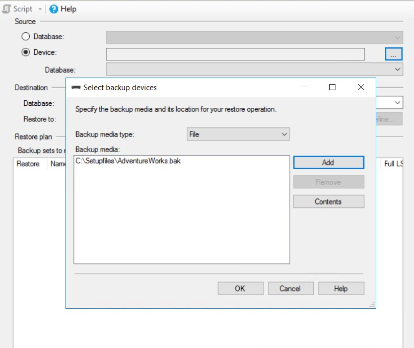

11. Click **OK** to restore database: 

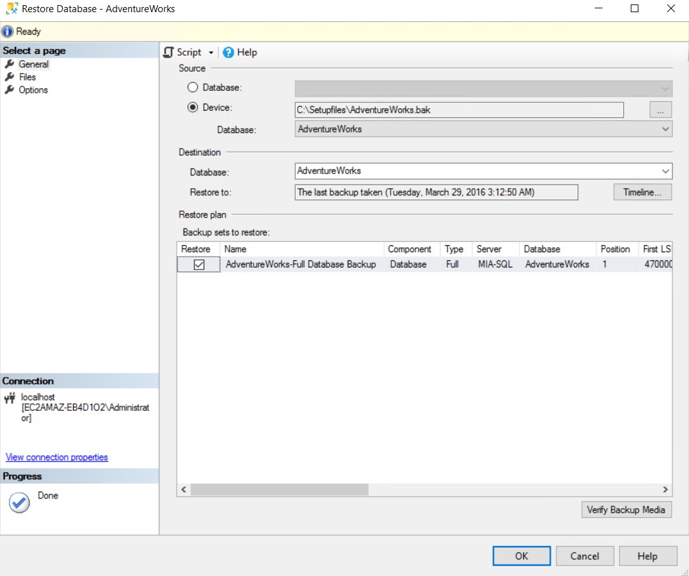

12. Confirm database has been restored successfully.

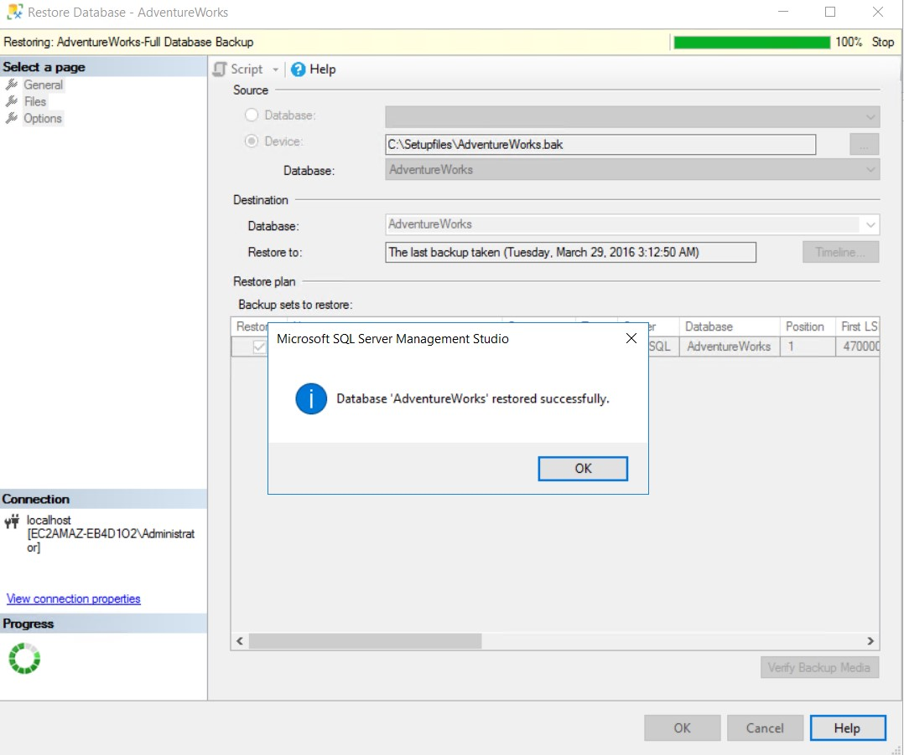

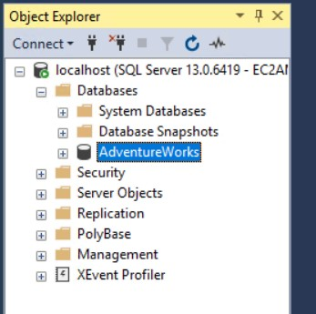

13. Repeat step 7 till the end again but select path `AdventureWorksDW.bak` in step 9 this time to restore another database.

